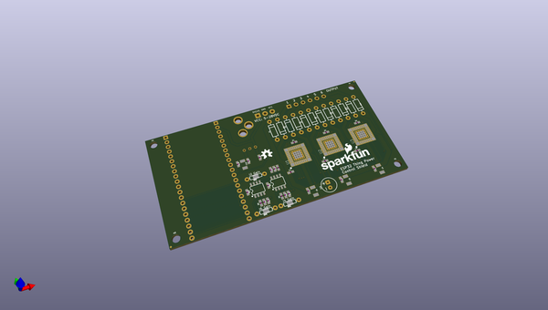
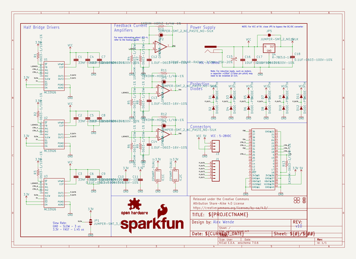
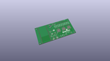
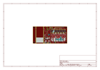
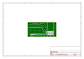
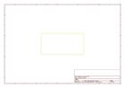
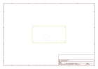
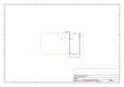
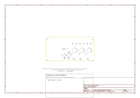

# OOMP Project  
## ESP32_Power_Control_Shield  by sparkfun  
  
oomp key: oomp_projects_flat_sparkfun_esp32_power_control_shield  
(snippet of original readme)  
  
ESP32 Thing Power Control Shield  
=======  
  
  
  
*[SparkFun ESP32 Thing Power Control Shield](https://www.sparkfun.com/products/14155)*  
  
The ESP32 Thing Power Control Shield is a small adapter board for the [ESP32 Thing](https://www.sparkfun.com/products/13907). The shield gives the ESP32 Thing the power to switch loads of up to 5A between 5 and 28VDC. The shield has 6 output pins to connect loads to, and three current sensors connected to outputs 2, 4, and 6. Operational amplifiers are by default configured as voltage followers, but feedback resistors are broken out to increase the gain of the non-inverting op-amp, which allows for greater precision depending on the maximum expected loads.   
  
Repository Contents  
-------------------  
  
* **/Production** - Panelized version of the design for production  
* **/Hardware** - All Eagle design files (.brd, .sch)  
  
License Information  
-------------------  
  
This design is [OSHW](http://www.oshwa.org/definition/) and public domain but you buy me a beer if you use this and we meet someday ([Beerware license](http://en.wikipedia.org/wiki/Beerware)).  
  full source readme at [readme_src.md](readme_src.md)  
  
source repo at: [https://github.com/sparkfun/ESP32_Power_Control_Shield](https://github.com/sparkfun/ESP32_Power_Control_Shield)  
## Board  
  
  
## Schematic  
  
  
  
[schematic pdf](working_schematic.pdf)  
## Images  
  
  
  
  
  
  
  
  
  
  
  
  
  
  
  
  
