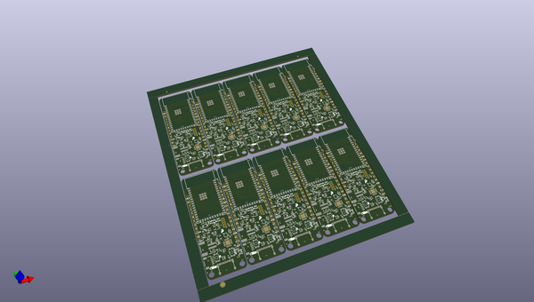
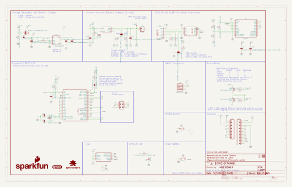
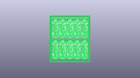
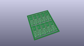
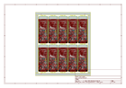
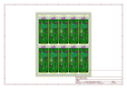
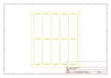
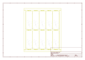
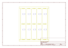
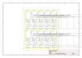

# OOMP Project  
## ESP32-S2_Thing_Plus  by sparkfun  
  
oomp key: oomp_projects_flat_sparkfun_esp32_s2_thing_plus  
(snippet of original readme)  
  
SparkFun ESP32-S2 Thing Plus  
========================================  
  
  
  
[*SparkFun ESP32-S2 Thing Plus (WRL-17381)*](https://www.sparkfun.com/products/17743)  
  
The [SparkFun ESP32-S2 Thing Plus](https://www.sparkfun.com/products/17743) is a comprehensive development platform for [Espressif's ESP32](https://espressif.com/en/products/hardware/esp32/overview). This board has the ESP32-S2-WROOM (4MB) version of the module. The new ESP32-S2 module addresses the [security flaws](https://www.espressif.com/en/news/ESP32_FIA_Analysis) in the original ESP32. While the ESP32-S2 does include improved security features, it lacks the Bluetooth capabilities of the original ESP32 module. The ESP32-S2 Thing Plus includes a Qwiic adapter, LiPo battery JST connector, and 21 I/O pins.  
  
Repository Contents  
-------------------  
  
* **/Hardware** - Eagle design files (.brd, .sch)  
* **/Hardware/Production** - Production panel files (gerbers, .brd)  
  
Documentation  
--------------  
* **[Hookup Guide](https://learn.sparkfun.com/tutorials/1660)** - Basic hookup guide for the ESP32-S2 Thing Plus.  
* **[SparkFun Graphical Datasheets](https://github.com/sparkfun/Graphical_Datasheets)** -Graphical Datasheets for various SparkFun products.  
  
Product Versions  
----------------  
* [WRL-17743](https://www.sparkfun.com/products/17743)- v1.0, Initial   
  full source readme at [readme_src.md](readme_src.md)  
  
source repo at: [https://github.com/sparkfun/ESP32-S2_Thing_Plus](https://github.com/sparkfun/ESP32-S2_Thing_Plus)  
## Board  
  
  
## Schematic  
  
  
  
[schematic pdf](working_schematic.pdf)  
## Images  
  
  
  
  
  
  
  
  
  
  
  
  
  
  
  
  
