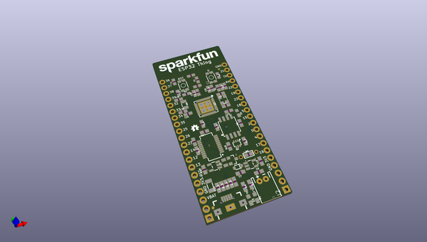

# OOMP Project  
## ESP32_Thing  by sparkfun  
  
(snippet of original readme)  
  
SparkFun ESP32 Thing  
========================================  
  
  
  
[*SparkFun ESP32 Thing (DEV-13907)*](https://www.sparkfun.com/products/13907)  
  
The [SparkFun ESP32 Thing](https://www.sparkfun.com/products/13907) is a comprehensive development platform for Espressif’s ESP32, their super-charged version of the popular ESP8266. Like the 8266, the ESP32 is a WiFi-compatible microcontroller but adds nearly 30 I/O pins. The ESP32’s power and versatility will make it the foundation of IoT and connected projects for many years to come.  
  
Why the name? We lovingly call it the “Thing” because it's the perfect foundation for your Internet of Things project. The Thing does everything from turning on an LED to posting data with your chosen platform, and can be programmed just like any microcontroller. You can even program the Thing through the Arduino IDE by installing the [ESP32 Arduino Core](https://learn.sparkfun.com/tutorials/esp32-thing-hookup-guide-installing-the-esp32-arduino-core).  
  
The SparkFun ESP32 Thing equips the ESP32 with everything necessary to program, run and develop on the wonderchip. In addition to the WiFi SoC, the Thing includes an FTDI FT231x, which converts USB to serial, and allows your computer to program and communicate with the microcontroller. It also features a LiPo charger, so your ESP32 project can be battery-powered and truly wire  
  full source readme at [readme_src.md](readme_src.md)  
  
source repo at: [https://github.com/sparkfun/ESP32_Thing](https://github.com/sparkfun/ESP32_Thing)  
## Board  
  
  
## Schematic  
  
  
  
[schematic pdf](working_schematic.pdf)  
## Images  
  
  
  
  
  
  
  
  
  
  
  
  
  
  
  
  
