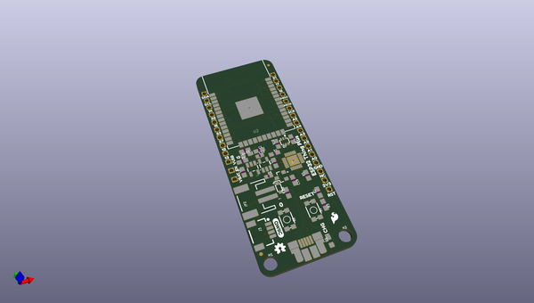
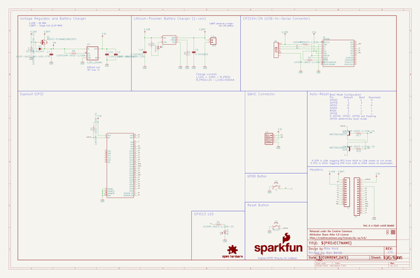

# OOMP Project  
## ESP32_Thing_Plus  by sparkfun  
  
(snippet of original readme)  
  
SparkFun ESP32 Thing Plus  
========================================  
  
  
  
[*SparkFun ESP32 Thing Plus (WRL-15663)*](https://www.sparkfun.com/products/15663)  
  
The [SparkFun ESP32 Thing Plus](https://www.sparkfun.com/products/15663) is a comprehensive development platform for [Espressif's ESP32](https://espressif.com/en/products/hardware/esp32/overview). Like the 8266 and ESP32 Thing, the ESP32 Thing Plus is a **WiFi**-compatible microcontroller with support for **Bluetooth low-energy** (i.e BLE, BT4.0, Bluetooth Smart), a Qwiic adapter, and 21 I/O pins. Add to that a rich set of peripherals ranging from capacitive touch sensors, SD card interface, Ethernet, high-speed SPI, UART, I2S and I2C.  
  
Upgraded and easy to use, the Esp32 Thing Plus will help make it the foundation of IoT and connected projects for many years to come.  
  
Repository Contents  
-------------------  
  
* **/Hardware** - Eagle design files (.brd, .sch)  
* **/Production** - Production panel files (.brd)  
  
Documentation  
--------------  
* **[Hookup Guide](https://learn.sparkfun.com/tutorials/esp32-thing-plus-hookup-guide)** - Basic hookup guide for the ESP32 Thing Plus.  
* **[SparkFun Fritzing repo](https://github.com/sparkfun/Fritzing_Parts)** - Fritzing diagrams for SparkFun products.  
* **[SparkFun Graphical Datasheets](https://github.com/sparkfun/  
  full source readme at [readme_src.md](readme_src.md)  
  
source repo at: [https://github.com/sparkfun/ESP32_Thing_Plus](https://github.com/sparkfun/ESP32_Thing_Plus)  
## Board  
  
  
## Schematic  
  
  
  
[schematic pdf](working_schematic.pdf)  
## Images  
