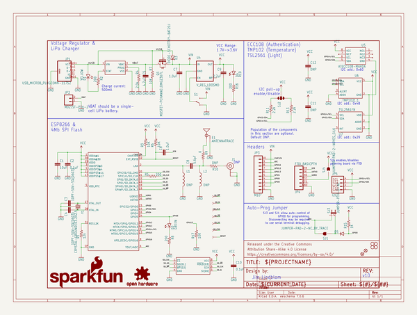
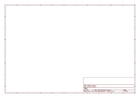
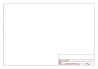

# OOMP Project  
## ESP8266_Thing  by sparkfun  
  
(snippet of original readme)  
  
SparkFun ESP8266 Thing  
========================================  
  
  
  
[*SparkFun ESP8266 Thing (WRL-13231)*](https://www.sparkfun.com/products/13231)  
  
The [SparkFun ESP8266 Thing](https://www.sparkfun.com/products/13231) is essentially a breakout and development board for the ESP8266 WiFi SoC. Why the name? We lovingly call it the Thing due to it being the perfect foundation for your Internet of Things. Over the past year, the ESP8266 has been a growing star among IoT or WiFi-related projects. It’s an extremely cost-effective WiFi module, that – with a little extra effort – can be programmed just like any microcontroller. The only unfortunate part is: the ESP8266 has mostly only been available in a tiny, modular form, which, with limited I/O and a “unique” pin-out, can be difficult to build a project around. SparkFun’s new development board for the ESP8266 breaks out all of the module’s pins, and comes equipped with a LiPo charger, power supply, and all of the other supporting circuitry it requires.  
  
The SparkFun ESP8266 Thing is a relatively simple board. The pins are broken out to two parallel, breadboard-compatible rows. USB and LiPo connectors at the top of the board provide power – controlled by the nearby ON/OFF switch. And LEDs towards the inside of the board indicate power, charge, and status of the IC. The ESP8266’s maximum voltage is 3.6V,   
  full source readme at [readme_src.md](readme_src.md)  
  
source repo at: [https://github.com/sparkfun/ESP8266_Thing](https://github.com/sparkfun/ESP8266_Thing)  
## Board  
  
  
## Schematic  
  
  
  
[schematic pdf](working_schematic.pdf)  
## Images  
  
  
  
  
  
  
  
  
  
  
  
  
  
  
  
  
