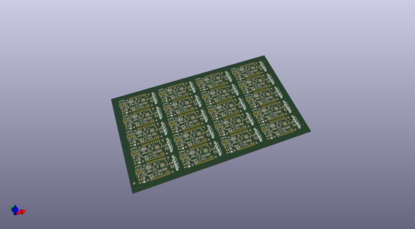
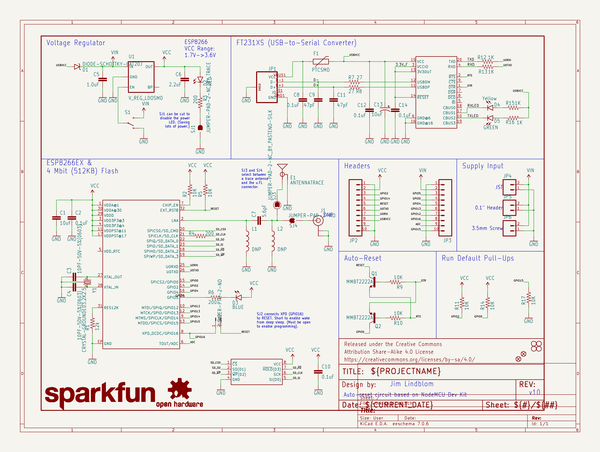

# OOMP Project  
## ESP8266_Thing_Dev  by sparkfun  
  
oomp key: oomp_projects_flat_sparkfun_esp8266_thing_dev  
(snippet of original readme)  
  
SparkFun ESP8266 Thing Development Board  
========================================  
  
  
  
[*SparkFun ESP8266 Thing Development Board  (WRL-13711)*](https://www.sparkfun.com/products/13711)  
  
The [SparkFun ESP8266 Thing Development Board](https://www.sparkfun.com/products/13711) is a breakout and development board for the ESP8266 WiFi SoC. Why the name? We lovingly call it the Thing because it's the perfect foundation for your Internet of Things (IoT) project. The ESP8266 is an extremely cost-effective WiFi module, that can be programmed just like any microcontroller, and wiggle I/O while it communicates with the world-wide-web.  
  
This version of the [Thing](https://www.sparkfun.com/products/13231) equips the ESP8266 with an **onboard FTDI FT231X**, which is used to program the chip over a USB interface. No external programming board required! The ESP8266's I/O pins are broken out to two parallel, breadboard-compatible rows. And LEDs towards the inside of the board indicate power, communication, and status of the IC. The ESP8266’s maximum voltage is 3.6V, so the Thing Development Board has an onboard 3.3V regulator to deliver a safe, consistent voltage to the IC. That means the ESP8266’s I/O pins also run at 3.3V, you’ll need to level shift any 5V signals running into the IC.  
  
Repository Contents  
-------------------  
  
* **/Hardware** - Eagle design files (.brd, .sch)  
* **/Producti  
  full source readme at [readme_src.md](readme_src.md)  
  
source repo at: [https://github.com/sparkfun/ESP8266_Thing_Dev](https://github.com/sparkfun/ESP8266_Thing_Dev)  
## Board  
  
  
## Schematic  
  
  
  
[schematic pdf](working_schematic.pdf)  
## Images  
