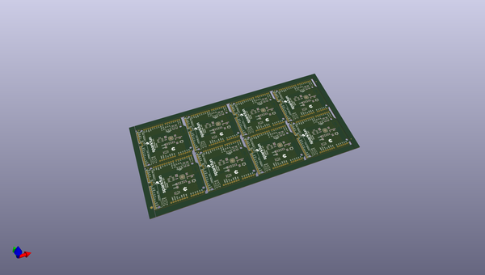
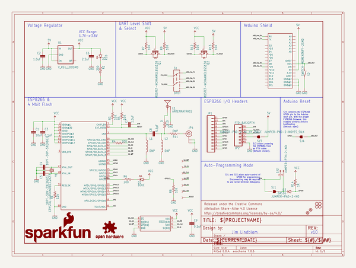
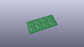
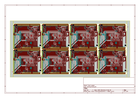
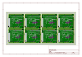
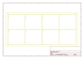
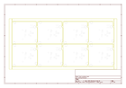
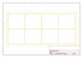
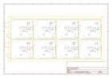

# OOMP Project  
## ESP8266_WiFi_Shield  by sparkfun  
  
(snippet of original readme)  
  
SparkFun ESP8266 WiFi Shield  
========================================  
  
  
  
[*SparkFun ESP8266 WiFi Shield (WRL-13287)*](https://www.sparkfun.com/products/13287)  
  
The [SparkFun ESP8266 WiFi Shield](https://www.sparkfun.com/products/13287) is essentially an Arduino shield for the ESP8266 WiFi SoC. The ESP8266 ships with a slightly customized version of the Espressif AT command set.  
  
The ESP8266 is controlled by serial AT commands. The shield is equipped with a switch to swap between a software serial port or hardware serial port interface.  
  
Repository Contents  
-------------------  
  
* **/Firmware** - Firmware flashed on the ESP8266 WiFi Shield (requires ESP8266 SDK 1.2.0)  
* **/Hardware** - Eagle design files (.brd, .sch)  
* **/Production** - Production panel files (.brd)  
  
Documentation  
--------------  
* **[Hookup Guide](https://learn.sparkfun.com/tutorials/esp8266-wifi-shield-hookup-guide)** - Exhaustive hookup guide for the ESP8266 WiFi Shield.  
  
Product Versions  
----------------  
* [DEV-13287](https://www.sparkfun.com/products/13287)- V1.0 release of the WiFi Shield.  
  
License Information  
-------------------  
This product is _**open source**_!   
  
The **hardware** is released under [Creative Commons ShareAlike 4.0 International](https://creativecommons.org/licenses/by-sa/4.0/).  
  
The **code** is beerware; if you see me (or any other SparkFun employee) at the local, and you've found our code he  
  full source readme at [readme_src.md](readme_src.md)  
  
source repo at: [https://github.com/sparkfun/ESP8266_WiFi_Shield](https://github.com/sparkfun/ESP8266_WiFi_Shield)  
## Board  
  
  
## Schematic  
  
  
  
[schematic pdf](working_schematic.pdf)  
## Images  
  
  
  
  
  
  
  
  
  
  
  
  
  
  
  
  
