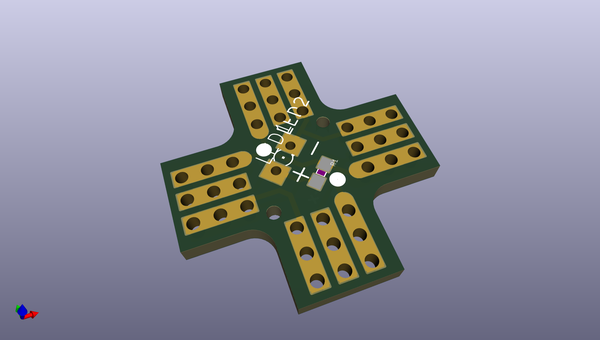
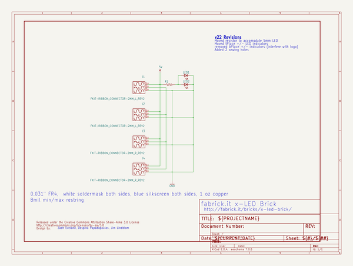
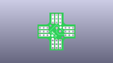
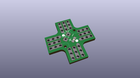
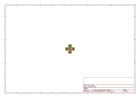
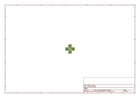
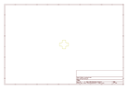
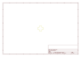
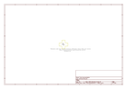

# OOMP Project  
## Fabrickit_LED_Brick  by sparkfun  
  
oomp key: oomp_projects_flat_sparkfun_fabrickit_led_brick  
(snippet of original readme)  
  
Fabrickit LED Brick  
====================  
  
[   
*Fabrickit LED Brick (DEV-10412)*](https://www.sparkfun.com/products/10412)  
  
This is an LED brick for the fabrickit collection.   
  
Repository Contents  
-------------------  
  
* **/Hardware** - All Eagle design files (.brd, .sch)  
  
License Information  
-------------------  
The hardware is released under [Creative Commons Share-alike 3.0](http://creativecommons.org/licenses/by-sa/3.0/).    
  
-> This product is a collaboration with fabrickit<-  
  
  full source readme at [readme_src.md](readme_src.md)  
  
source repo at: [https://github.com/sparkfun/Fabrickit_LED_Brick](https://github.com/sparkfun/Fabrickit_LED_Brick)  
## Board  
  
  
## Schematic  
  
  
  
[schematic pdf](working_schematic.pdf)  
## Images  
  
  
  
  
  
  
  
  
  
  
  
  
  
  
  
  
