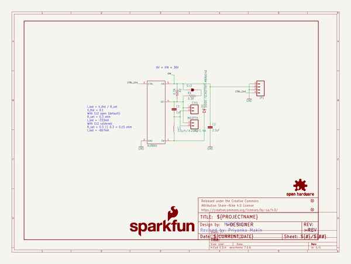
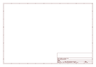

# OOMP Project  
## FemtoBuck  by sparkfun  
  
oomp key: oomp_projects_flat_sparkfun_femtobuck  
(snippet of original readme)  
  
FemtoBuck LED Driver  
===================    
](https://cdn.sparkfun.com/assets/parts/1/1/2/1/0/13716-01.jpg)   
   
[*FemtoBuck LED Driver (COM-13716)*](https://www.sparkfun.com/products/13716)   
  
This breakout board allows you to dim a single high-power channel of LEDs from 0-330mA, or 0-660mA (depending on the setting of a solder jumper), at up to 36V.   
Dimming control can be either via PWM or via analog signal from 0-2.5V.  
  
Repository Contents  
-------------------  
* **/Hardware** - All Eagle design files (.brd, .sch)  
* **/Production** - Test bed files and production panel files  
  
Documentation  
--------------  
* **[Hookup Guide](https://learn.sparkfun.com/tutorials/femtobuck-constant-current-led-driver-hookup-guide)** - Basic hookup guide for the FemtoBuck.  
* **[SparkFun Fritzing repo](https://github.com/sparkfun/Fritzing_Parts)** - Fritzing diagrams for SparkFun products.  
* **[SparkFun 3D Model repo](https://github.com/sparkfun/3D_Models)** - 3D models of SparkFun products.   
  
Product Versions  
----------------  
* [COM-13716](https://www.sparkfun.com/products/13716)- Version 1.2. Currently for sale.   
* [COM-12937] (https://www.sparkfun.com/products/12937)- Version 1.0. Retired.   
  
Version History  
---------------  
* [V_1.2](https://github.com/sparkfun/FemtoBuck/tree/V_1.2) - GitHub files for version 1.2.   
* [V_1.0](https://github.com/sparkfun/FemtoBuck/tree/v_10) - GitHub files for version 1.0.   
  
License   
  full source readme at [readme_src.md](readme_src.md)  
  
source repo at: [https://github.com/sparkfun/FemtoBuck](https://github.com/sparkfun/FemtoBuck)  
## Board  
  
  
## Schematic  
  
  
  
[schematic pdf](working_schematic.pdf)  
## Images  
  
  
  
  
  
  
  
  
  
  
  
  
  
  
  
  
