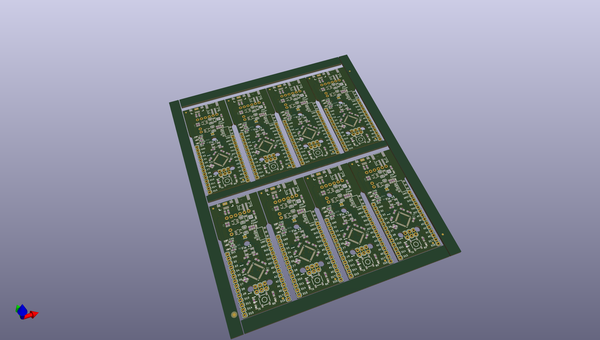

# OOMP Project  
## Fio_v3  by sparkfun  
  
(snippet of original readme)  
  
Fio v3  
======  
  
[    
*Fio v3-ATmega32U4 (DEV-11520)*](https://www.sparkfun.com/products/11520)  
  
The Fio v3 is a ATmega32U4 powered system, similar to the ARduino Fio. This board is compatible with a Lipo battery and XBees, and   
runs at 3.3v and 8MHz.   
  
Repository Contents  
-------------------  
* **/Firmware** - Arduino example code used in the hookup guide  
* **/Hardware** - All Eagle design files (.brd, .sch, .STL)  
* **/Production** - Test bed files and production panel files  
  
Documentation  
--------------  
* **[Hookup Guide](https://learn.sparkfun.com/tutorials/pro-micro--fio-v3-hookup-guide)** - Basic hookup guide for the FioV3.  
* **[SparkFun Arduino Board Addon](https://github.com/sparkfun/Arduino_Boards/)** - Arduino board addon for FioV3.  
   
License Information  
-------------------  
This product is _**open source**_!   
  
Please review the LICENSE.md file for license information.   
  
If you have any questions or concerns on licensing, please contact techsupport@sparkfun.com.  
  
Distributed as-is; no warranty is given.  
  
- Your friends at SparkFun.  
  
_<COLLABORATION CREDIT>_  
  
  full source readme at [readme_src.md](readme_src.md)  
  
source repo at: [https://github.com/sparkfun/Fio_v3](https://github.com/sparkfun/Fio_v3)  
## Board  
  
  
## Schematic  
  
  
  
[schematic pdf](working_schematic.pdf)  
## Images  
