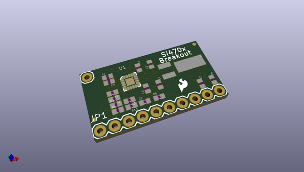
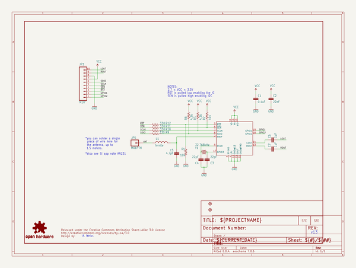
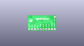
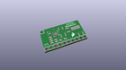
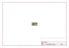
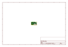
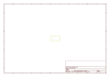
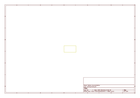
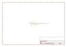

# OOMP Project  
## FM_Tuner_Basic_Breakout-Si4703  by sparkfun  
  
oomp key: oomp_projects_flat_sparkfun_fm_tuner_basic_breakout_si4703  
(snippet of original readme)  
  
SparkFun FM Tuner Basic Breakout - Si4703  
========================================  
  
  
  
[*SparkFun FM Tuner Basic Breakout - Si4703 (BOB-11083)*](https://www.sparkfun.com/products/11083)  
  
This breakout for the Silicon Laboratories Si4703 FM tuner chip is a little more stripped down than our FM Tuner Evaluation Board. If your project already has an amp and just needs a full-featured FM tuner, this is the board for you.   
  
_Note: If you are using a different microcontroller that is 5V, you will need to connect to the [respective I2C pins](https://www.arduino.cc/en/reference/wire), and match the [logic levels](https://learn.sparkfun.com/tutorials/logic-levels). Make sure to add the [4-channel bi-directional logic level converter](https://www.sparkfun.com/products/12009) between SDIO, SCLK, RST, and GPIO2._  
  
Repository Contents  
-------------------  
  
* **/Firmware** - Example code   
* **/Hardware** - Eagle design files (.brd, .sch)  
* **/Libraries** - Libraries for use with the <PRODUCT NAME>  
* **/Production** - Production panel files (.brd)  
  
Documentation  
--------------  
* **[Library](https://github.com/sparkfun/SparkFun_Si4703_Arduino_Library)** - Arduino library for the Si4703.  
* **[SparkFun Fritzing repo](https://github.com/sparkfun/Fritzing_Parts)** - Fritzing diagrams for SparkFun products.  
* **[SparkFun 3D Model repo](https://github.com/sparkfun/3D_Models)** - 3D models of Spar  
  full source readme at [readme_src.md](readme_src.md)  
  
source repo at: [https://github.com/sparkfun/FM_Tuner_Basic_Breakout-Si4703](https://github.com/sparkfun/FM_Tuner_Basic_Breakout-Si4703)  
## Board  
  
  
## Schematic  
  
  
  
[schematic pdf](working_schematic.pdf)  
## Images  
  
  
  
  
  
  
  
  
  
  
  
  
  
  
  
  
