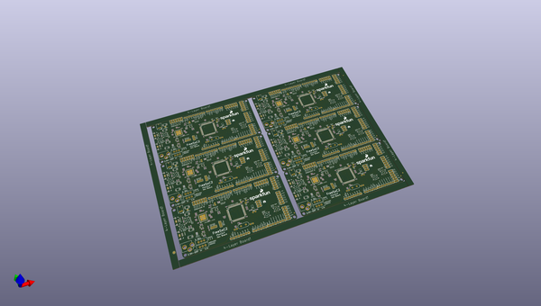

# OOMP Project  
## FreeSoc2  by sparkfun  
  
oomp key: oomp_projects_flat_sparkfun_freesoc2  
(snippet of original readme)  
  
SparkFun FreeSoc2  
========================================  
  
  
  
[*SparkFun FreeSoC2 (DEV-13714)*](https://www.sparkfun.com/products/13714)  
  
The [FreeSoc2 is SparkFun's PSoC5LP development board](https://www.sparkfun.com/products/13714). It features a full onboard debugger, support for 5V and 3.3V IO voltages, and a CY8C5888AXI-LP096 processor with 256kB of flash, 64kB of SRAM and 2kB of EEPROM. The onboard oscillator can drive the processor at up to 80MHz, and the Cortex-M3 core provides superior performance.  
  
The real power of the PSoC5LP isn't in the processor, however. Wrapped around the processor is a rich analog and digital programmable fabric which can be configured to provide many functions which would otherwise need to be realized in code (lowering system performance) or external circuitry (adding cost and board size). In addition, the highly flexible fabric means that most any function can be routed to most any pin, which makes this a wonderful tool for development and allows board layout errors to be solved, at least temporarily, pretty easily.  
  
Repository Contents  
-------------------  
  
* **/Hardware** - Eagle design files (.brd, .sch)  
* **/Production** - Production panel files (.brd)  
  
Documentation  
--------------  
* **[Arduino Board Support](https://github.com/sparkfun/PSoC_Arduino_Support)** - Support board files for adding the FreeSoC2 to the Arduino I  
  full source readme at [readme_src.md](readme_src.md)  
  
source repo at: [https://github.com/sparkfun/FreeSoc2](https://github.com/sparkfun/FreeSoc2)  
## Board  
  
  
## Schematic  
  
  
  
[schematic pdf](working_schematic.pdf)  
## Images  
