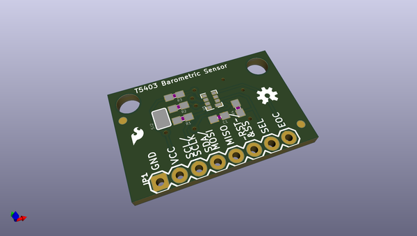

# OOMP Project  
## Fritzing_Parts  by sparkfun  
  
oomp key: oomp_projects_flat_sparkfun_fritzing_parts  
(snippet of original readme)  
  
Fritzing Parts  
==============  
  
This repo houses all of the SFE Fritzing parts for use in diagrams in tutorials. If you create a new part in Fritzing that correlates to an SFE part, please add it here so others may use it and to avoid duplication. Make sure to also check Fritzing software for additional boards.   
  
Repository Contents  
-------------------  
  
* **/kits** - Fritzing circuits (**&-42;.fzz**) and images (**&-42;.png**)from a few of our Inventor's Kits  
* **/parts** - Common Fritzing parts and vector (**&-42;.svg**) files of individual components on SparkFun boards  
* **/products** - Fritzing boards (**&-42;.fzpz** and some **&-42;.fzz**)  
* **/templates** - SparkFun T5403 Barometer Breakout vector (**&-42;.svg**) templates used in the SparkFun tutorial to [Make Your Own Fritzing Part]((https://learn.sparkfun.com/tutorials/make-your-own-fritzing-parts) )  
  
Documentation  
-------------  
* [Make Your Own Fritzing Parts](https://learn.sparkfun.com/tutorials/make-your-own-fritzing-parts)   
  
Contributing/Adding Fritzing Parts  
---------------------------------  
  
Please check out the Fritzing tutorial [here](https://github.com/fritzing/fritzing-parts/blob/master/CONTRIBUTING.md) for more information.   
  
  full source readme at [readme_src.md](readme_src.md)  
  
source repo at: [https://github.com/sparkfun/Fritzing_Parts](https://github.com/sparkfun/Fritzing_Parts)  
## Board  
  
  
## Schematic  
  
  
  
[schematic pdf](working_schematic.pdf)  
## Images  
