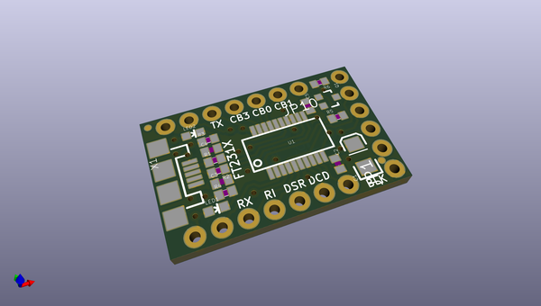
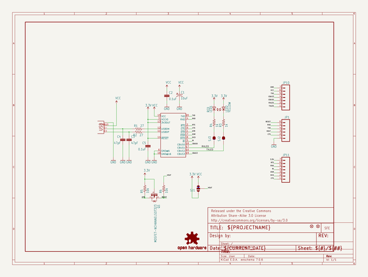

# OOMP Project  
## FT231X_Breakout  by sparkfun  
  
(snippet of original readme)  
  
FT231X Breakout  
========================  
  
[    
*FT231X Breakout (BOB-11736)*](https://www.sparkfun.com/products/11736)  
  
This is a simple breakout board for the FTDI FT231X. A **USB to serial UART** interface with full modem control. The board has a micro USB connector, and other support circuitry to get the IC quickly up-and-running.  
  
Repository Contents  
-------------------  
  
* **/hardware** - PCB design files (created with Eagle 6.1.0)  
* **/Production Files** - Test bed files and production panel files  
  
License Information  
-------------------  
  
All contents of this repository are released under [Creative Commons Share-alike 3.0](http://creativecommons.org/licenses/by-sa/3.0/).  
  
Author  
------  
  
Jim Lindblom, [SparkFun Electronics](https://www.sparkfun.com)  
  
  full source readme at [readme_src.md](readme_src.md)  
  
source repo at: [https://github.com/sparkfun/FT231X_Breakout](https://github.com/sparkfun/FT231X_Breakout)  
## Board  
  
  
## Schematic  
  
  
  
[schematic pdf](working_schematic.pdf)  
## Images  
