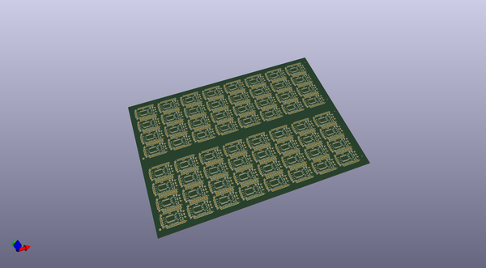
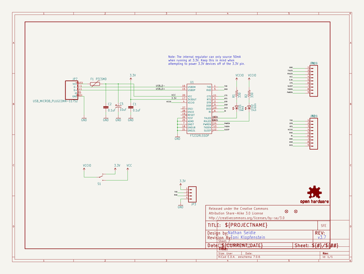
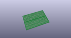
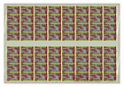
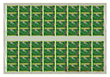
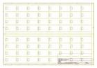
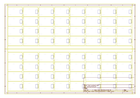
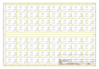

# OOMP Project  
## FT232RL_USB_Breakout  by sparkfun  
  
(snippet of original readme)  
  
FT232RL USB Breakout  
====================  
  
[  
*FT232RL USB to Serial Breakout Board (BOB-12731)*](https://www.sparkfun.com/products/12731)  
  
This is a basic breakout board for FTDI's popular USB to UART IC.  
VCCIO is selectable between VCC and 3.3V with an on-board switch.   
  
  
Repository Contents  
-------------------  
* **/Hardware** - All Eagle design files (.brd, .sch)  
* **/Production** - Test bed files and production panel files  
  
Product Versions  
----------------  
* [BOB-00718](https://www.sparkfun.com/products/718)- Version 3.6 with mini-B connector. Retired.   
  
Version History  
---------------  
* [v3.6](https://github.com/sparkfun/FT232RL_USB_Breakout/tree/V_3.6) - Version 3.6 GitHub files.  
  
License Information  
-------------------  
The hardware is released under [Creative Commons ShareAlike 4.0 International](https://creativecommons.org/licenses/by-sa/4.0/).  
The code is beerware; if you see me (or any other SparkFun employee) at the local, and you've found our code helpful, please buy us a round!  
  
Distributed as-is; no warranty is given.  
  
  
  full source readme at [readme_src.md](readme_src.md)  
  
source repo at: [https://github.com/sparkfun/FT232RL_USB_Breakout](https://github.com/sparkfun/FT232RL_USB_Breakout)  
## Board  
  
  
## Schematic  
  
  
  
[schematic pdf](working_schematic.pdf)  
## Images  
  
  
  
  
  
  
  
  
  
  
  
  
  
  
  
  
