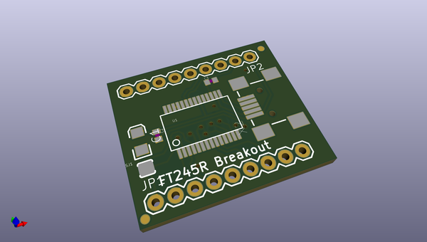
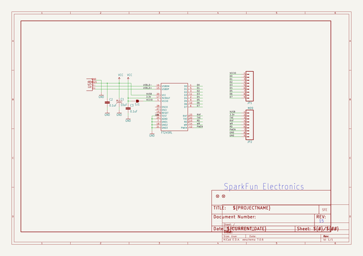
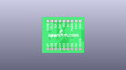
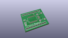
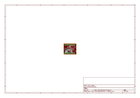
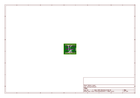
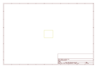
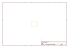
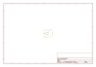

# OOMP Project  
## FT245RL_Breakout  by sparkfun  
  
(snippet of original readme)  
  
SparkFun USB to FIFO- FT245RL Breakout  
========================================  
  
  
  
[*SparkFun USB to FIFO- FT245RL Breakout (BOB-07841)*](https://www.sparkfun.com/products/7841)  
  
Basic breakout board for FTDI’s popular USB to FIFO IC.   
  
Repository Contents  
-------------------  
* **/Hardware** - All Eagle design files (.brd, .sch, .STL)  
  
  
License Information  
-------------------  
The hardware is released under [Creative Commons ShareAlike 4.0 International](https://creativecommons.org/licenses/by-sa/4.0/).  
  
Distributed as-is; no warranty is given.  
  
  full source readme at [readme_src.md](readme_src.md)  
  
source repo at: [https://github.com/sparkfun/FT245RL_Breakout](https://github.com/sparkfun/FT245RL_Breakout)  
## Board  
  
  
## Schematic  
  
  
  
[schematic pdf](working_schematic.pdf)  
## Images  
  
  
  
  
  
  
  
  
  
  
  
  
  
  
  
  
