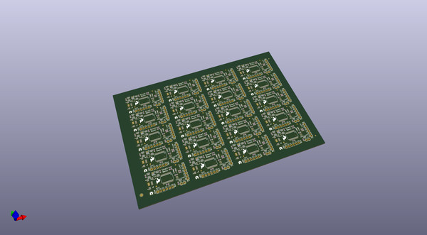
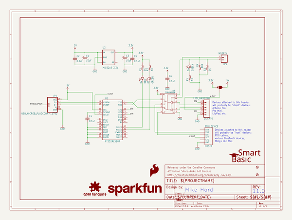

# OOMP Project  
## FTDI_SmartBasic  by sparkfun  
  
oomp key: oomp_projects_flat_sparkfun_ftdi_smartbasic  
(snippet of original readme)  
  
FTDI_SmartBasic  
===============  
[    
*FTDI SmartBasic (DEV-12935)*](https://www.sparkfun.com/products/12935)  
  
The FTDI SmartBasic uses a multiplexer to allow you to multiplex multiple serial   
devices into the hardware port on your Arduino Pro, Pro Mini, or other compatible   
board while still allowing you to program the board via the bootloader.  
  
Repository Contents  
-------------------  
* **/Hardware** - All Eagle design files (.brd, .sch)  
* **/Arduino** - All Arduino board examples  
* **/Fritizing** - Fritzing part files  
* **/Production** - Test bed files and production panel files  
  
License Information  
-------------------  
The hardware is released under [Creative Commons Share-alike 3.0](http://creativecommons.org/licenses/by-sa/3.0/).    
All other code is open source so please feel free to do anything you want with it; yo  
  
  full source readme at [readme_src.md](readme_src.md)  
  
source repo at: [https://github.com/sparkfun/FTDI_SmartBasic](https://github.com/sparkfun/FTDI_SmartBasic)  
## Board  
  
  
## Schematic  
  
  
  
[schematic pdf](working_schematic.pdf)  
## Images  
