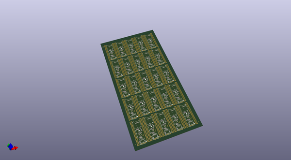
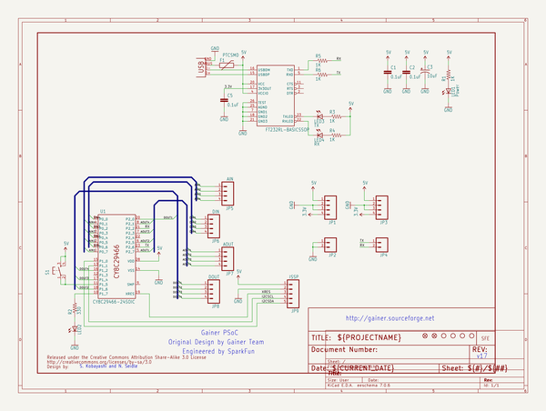
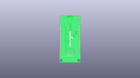
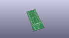
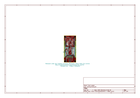
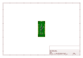
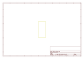
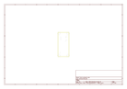

# OOMP Project  
## Gainer_PSoC_Development_Board  by sparkfun  
  
(snippet of original readme)  
  
SparkFun Gainer PSoC Development Board  
========================================  
  
  
  
[*SparkFun Gainer PSoC Development Board (DEV-08480)*](https://www.sparkfun.com/products/8480)  
  
This board utilizes the Cypress PSoC CY8C29466 IC making it a great board for digital and analog projects where AtoD and DtoA is required.  
 Simple USB interface for reprogramming - no external programmer needed.  
  
Repository Contents  
-------------------  
* **/Hardware** - All Eagle design files (.brd, .sch)  
  
  
License Information  
-------------------  
The hardware is released under [Creative Commons ShareAlike 4.0 International](https://creativecommons.org/licenses/by-sa/4.0/).  
  
Gainer is a simple board developed by Shigeru Kobayashi and the team at Gainer.cc.   
  
Distributed as-is; no warranty is given.  
  
  full source readme at [readme_src.md](readme_src.md)  
  
source repo at: [https://github.com/sparkfun/Gainer_PSoC_Development_Board](https://github.com/sparkfun/Gainer_PSoC_Development_Board)  
## Board  
  
  
## Schematic  
  
  
  
[schematic pdf](working_schematic.pdf)  
## Images  
  
  
  
  
  
  
  
  
  
  
  
  
  
  
  
  
