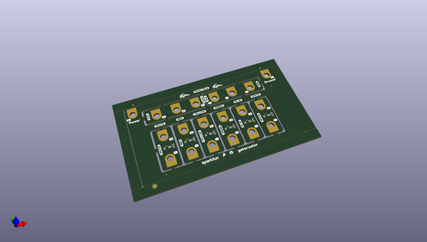
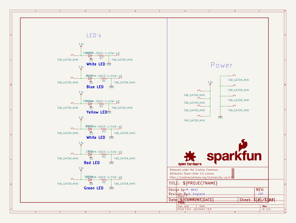
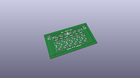
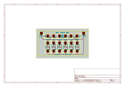
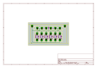
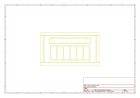

# OOMP Project  
## gator_color  by sparkfun  
  
oomp key: oomp_projects_flat_sparkfun_gator_color  
(snippet of original readme)  
  
SparkFun gator:color  
========================================  
  
  
[*SparkFun gator:color - COM-14890*](https://www.sparkfun.com/products/14890)  
  
The gator:color a smattering of LEDs into an alligator clippable format for use with micro:bit as well as the gator:bit expansion for micro:bit.  
  
Repository Contents  
-------------------  
* **/Firmware** - Example code used with the gator:color. While they are compiled HEX codes, you can modify the example code once they are imported into MakeCode editor.  
* **/Hardware** - Eagle design files (.brd, .sch)  
* **/Production** - Production panel files (.brd)  
  
Documentation  
--------------  
* **[Hookup Guide](https://learn.sparkfun.com/tutorials/gatorcolor-protosnap-hookup-guide)** - Basic hookup guide for the gator:color.  
  
Product Versions  
----------------  
* [COM-14890](https://www.sparkfun.com/products/14890)- The gator:color allows you to gator-clip to LED's.  
  
License Information  
-------------------  
  
This product is _**open source**_!   
  
Please review the LICENSE.md file for license information.   
  
If you have any questions or concerns on licensing, please contact techsupport@sparkfun.com.  
  
Distributed as-is; no warranty is given.  
  
- Your friends at SparkFun.  
  
_<COLLABORATION CREDIT>_  
  
  full source readme at [readme_src.md](readme_src.md)  
  
source repo at: [https://github.com/sparkfun/gator_color](https://github.com/sparkfun/gator_color)  
## Board  
  
  
## Schematic  
  
  
  
[schematic pdf](working_schematic.pdf)  
## Images  
  
  
  
  
  
  
  
  
  
  
  
  
  
  
  
  
