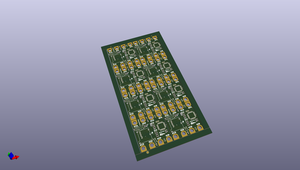
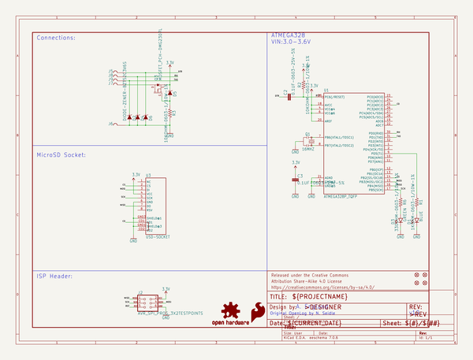
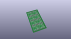
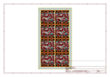
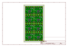
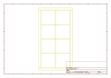
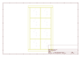
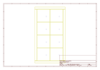
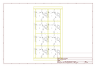

# OOMP Project  
## gator_log  by sparkfun  
  
(snippet of original readme)  
  
SparkFun gator:log - micro:bit Accessory Board  
========================================  
  
  
  
[*SparkFun gator:log - micro:bit Accessory Board (DEV-15270)*](https://www.sparkfun.com/products/15270)  
  
The gator:log is the perfect data logging tool for your next experiment. With the automation of the data collection process, gone are the days of rushing around with a pen and composition notebook to simultaneously record data and your observations. The gator:log allows a student(s) to focus more on what is happening in the experiment than watching a thermometer or sensor readout.  
  
Instead of using pin connections or requiring soldering, this product provides connection pads for a more kid freindly experience with alligator clips. The design intention of this product is to be used with the [gato:bit (v2)](https://www.sparkfun.com/products/15162), and the [micro:bit development board](https://www.sparkfun.com/products/14208).  
  
Repository Contents  
-------------------  
  
* **/Firmware/Qwiic_OpenLog** - The core sketch that runs Qwiic OpenLog  
* **/Hardware** - Eagle design files (.brd, .sch)  
  
Documentation  
--------------  
  
* **[Hookup Guide](https://learn.sparkfun.com/tutorials/sparkfun-gatorlog-hookup-guide)** - Basic hookup guide for the gator:log.  
* **[gator:RTC PXT Package](https://github.com/sparkfun/pxt-gator-log)** - PXT- packa  
  full source readme at [readme_src.md](readme_src.md)  
  
source repo at: [https://github.com/sparkfun/gator_log](https://github.com/sparkfun/gator_log)  
## Board  
  
  
## Schematic  
  
  
  
[schematic pdf](working_schematic.pdf)  
## Images  
  
  
  
  
  
  
  
  
  
  
  
  
  
  
  
  
