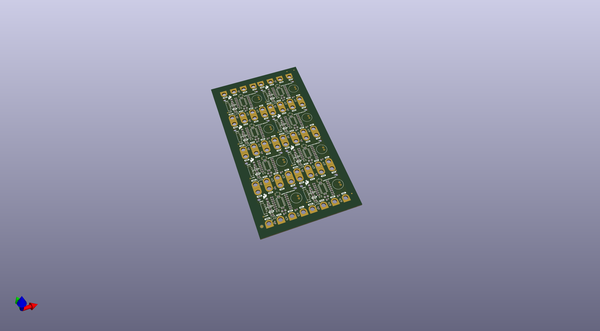
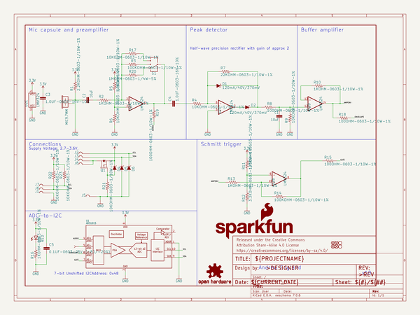
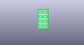
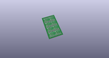
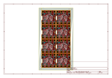
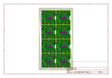
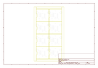
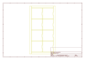
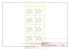

# OOMP Project  
## gator_microphone  by sparkfun  
  
(snippet of original readme)  
  
SparkFun gator:microphone - micro:bit Accessory Board   
=============================  
  
  
  
[*SparkFun gator:microphone - micro:bit Accessory Board (SEN-15289)*](https://www.sparkfun.com/products/15289)    
  
An I2C sensor for detecting sound with an electret microphone. The sensor measures the actual audio, amplitude envelope, and sound indication with an ADC (ADS1015).  
  
Instead of using pin connections or requiring soldering, this product provides connection pads for a more kid freindly experience with alligator clips. The design intention of this product is to be used with the [gato:bit (v2)](https://www.sparkfun.com/products/15162), and the [micro:bit development board](https://www.sparkfun.com/products/14208).  
  
Repository Contents  
-------------------  
  
* **/Hardware** - Eagle design files (.brd, .sch)  
* **/Production** - Production panel files (.brd)  
  
Documentation  
--------------  
  
* **[Hookup Guide](https://learn.sparkfun.com/tutorials/sparkfun-gatormicrophone-hookup-guide)** - Basic hookup guide for the gator:microphone.  
* **[gator:microphone PXT Package](https://github.com/sparkfun/pxt-gator-microphone)** - PXT- package for the MakeCode gator:microphone extension.  
  
License Information  
-------------------  
  
This product is _**open source**_!   
  
Please review the LICENSE.md file for license informatio  
  full source readme at [readme_src.md](readme_src.md)  
  
source repo at: [https://github.com/sparkfun/gator_microphone](https://github.com/sparkfun/gator_microphone)  
## Board  
  
  
## Schematic  
  
  
  
[schematic pdf](working_schematic.pdf)  
## Images  
  
  
  
  
  
  
  
  
  
  
  
  
  
  
  
  
