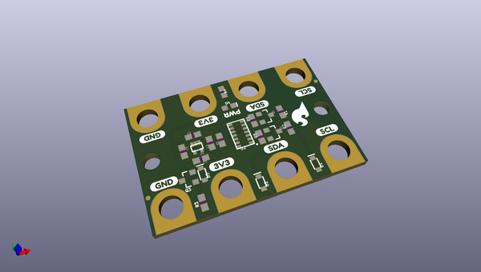
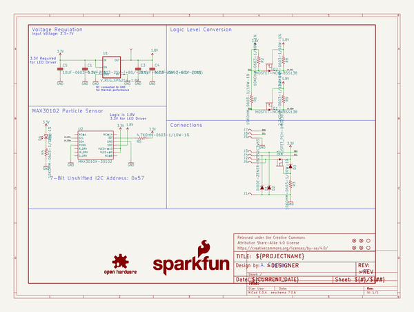

# OOMP Project  
## gator_particle  by sparkfun  
  
(snippet of original readme)  
  
SparkFun gator:particle - micro:bit Accessory Board  
=============================  
  
  
  
[*SparkFun gator:particle - micro:bit Accessory Board (SEN-15271)*](https://www.sparkfun.com/products/15271)  
  
An I2C sensor for detecting particles. Additionaly, the MAX30102 sensor can also be used for measure heart-rate and SpO2 using special algorithms. These algorithms have limited functionality and are primarily meant for demonstration purposed.  
  
*Example of pulse measurement:*  
  
  
Instead of using pin connections or requiring soldering, this product provides connection pads for a more kid freindly experience with alligator clips. The design intention of this product is to be used with the [gato:bit (v2)](https://www.sparkfun.com/products/15162), and the [micro:bit development board](https://www.sparkfun.com/products/14208).  
  
Repository Contents  
-------------------  
  
* **/Hardware** - Eagle design files (.brd, .sch)  
* **/Production** - Production panel files (.brd)  
  
Documentation  
--------------  
* **[Hookup Guide](https://learn.sparkfun.com/tutorials/sparkfun-gatorparticle-hookup-guide)** - Basic hookup guide for the gator:particle.  
* **[gator:particle PXT Package](https://github.com/sparkfun  
  full source readme at [readme_src.md](readme_src.md)  
  
source repo at: [https://github.com/sparkfun/gator_particle](https://github.com/sparkfun/gator_particle)  
## Board  
  
  
## Schematic  
  
  
  
[schematic pdf](working_schematic.pdf)  
## Images  
