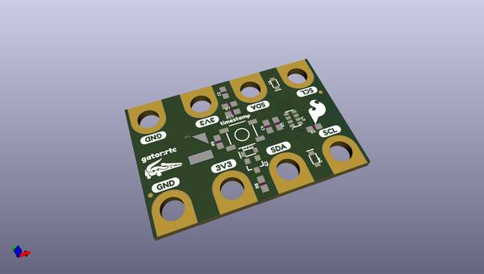
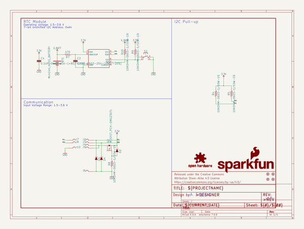
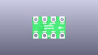
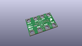
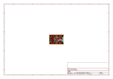
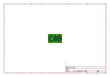
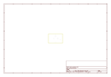
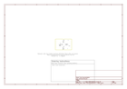

# OOMP Project  
## gator_rtc  by sparkfun  
  
(snippet of original readme)  
  
SparkFun gator:RTC - micro:bit Accessory Board  
=============================  
  
  
  
[*SparkFun gator:RTC - micro:bit Accessory Board (COM-15486)*](https://www.sparkfun.com/products/15486)    
  
The gator:RTC is a supplemental data logging tool to be used in conjunction with the [gator:log](https://www.sparkfun.com/products/15270), part of SparkFun's gator:bit series of gator-clippable accessories designed for easy interface with the micro:bit or other microcontrollers. This tool allows a student to focus more on the experiment than watching a thermometer or stopwatch.  
  
Instead of using pin connections or requiring soldering, this product provides connection pads for a more kid freindly experience with alligator clips. The design intention of this product is to be used with the [gato:bit (v2)](https://www.sparkfun.com/products/15162), and the [micro:bit development board](https://www.sparkfun.com/products/14208).  
  
Repository Contents  
-------------------  
  
* **/Hardware** - Eagle design files (.brd, .sch)  
  
Documentation  
--------------  
  
* **[Hookup Guide](https://learn.sparkfun.com/tutorials/sparkfun-gatorrtc-hookup-guide)** - Basic hookup guide for the gator:RTC.  
* **[gator:RTC PXT Package](https://github.com/sparkfun/pxt-gator-rtc)** - PXT- package for the MakeCode gator:RTC extension.  
  
License Information  
-------------------  
  
Th  
  full source readme at [readme_src.md](readme_src.md)  
  
source repo at: [https://github.com/sparkfun/gator_rtc](https://github.com/sparkfun/gator_rtc)  
## Board  
  
  
## Schematic  
  
  
  
[schematic pdf](working_schematic.pdf)  
## Images  
  
  
  
  
  
  
  
  
  
  
  
  
  
  
  
  
