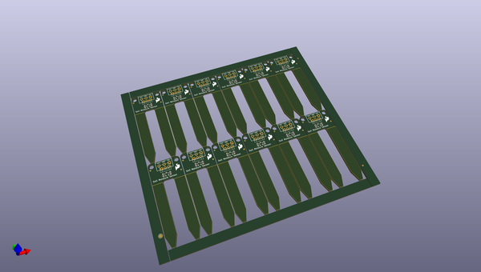
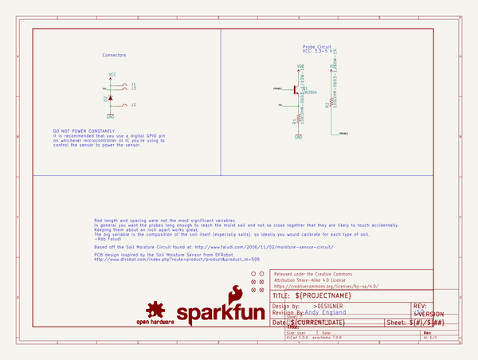
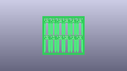
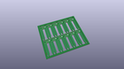
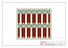
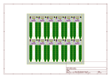
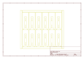
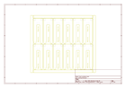
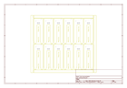

# OOMP Project  
## gator_soil  by sparkfun  
  
oomp key: oomp_projects_flat_sparkfun_gator_soil  
(snippet of original readme)  
  
SparkFun gator:soil - micro:bit Accessory Board   
=============================  
  
  
  
[*SparkFun gator:soil - micro:bit Accessory Board (SEN-15272)*](https://www.sparkfun.com/products/15272)  
  
A simple sensor for measuring of moisture content in soil and similar materials. Instead of using pin connections or requiring soldering, this product provides connection pads for a more kid freindly experience with alligator clips. The design intention of this product is to be used with the [gato:bit (v2)](https://www.sparkfun.com/products/15162), and the [micro:bit development board](https://www.sparkfun.com/products/14208).  
  
Repository Contents  
-------------------  
  
* **/Hardware** - Eagle design files (.brd, .sch)  
* **/Production** - Production panel files (.brd)  
  
Documentation  
--------------  
  
* **[Hookup Guide](https://learn.sparkfun.com/tutorials/sparkfun-gatorsoil-hookup-guide)** - Basic hookup guide for the gator:soil.  
* **[gator:soil PXT Package](https://github.com/sparkfun/pxt-gator-soil)** - PXT- package for the MakeCode gator:soil extension.  
  
License Information  
-------------------  
  
This product is _**open source**_!   
  
Please review the LICENSE.md file for license information.   
  
If you have any questions or concerns on licensing, please visit the [SparkFun Forum](https://forum.sparkfun.com/index.php) and post a topic. For m  
  full source readme at [readme_src.md](readme_src.md)  
  
source repo at: [https://github.com/sparkfun/gator_soil](https://github.com/sparkfun/gator_soil)  
## Board  
  
  
## Schematic  
  
  
  
[schematic pdf](working_schematic.pdf)  
## Images  
  
  
  
  
  
  
  
  
  
  
  
  
  
  
  
  
