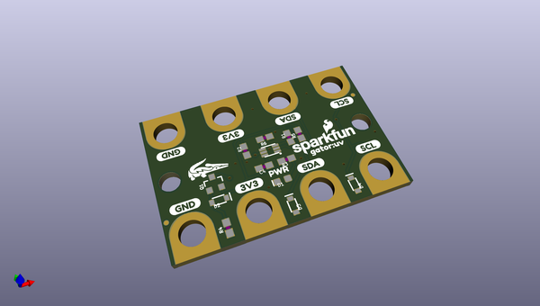
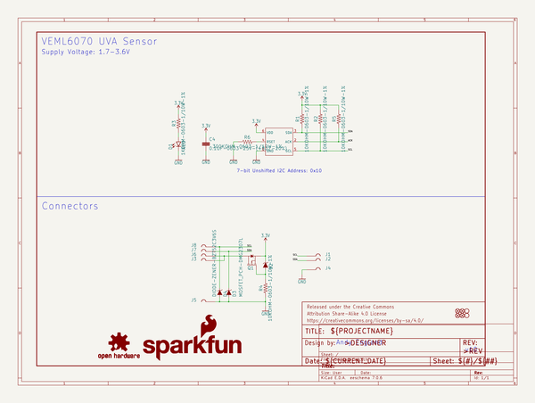
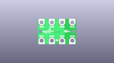
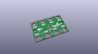
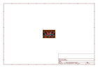
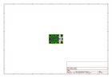
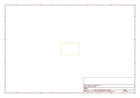
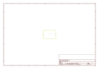
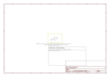

# OOMP Project  
## gator_UV  by sparkfun  
  
oomp key: oomp_projects_flat_sparkfun_gator_uv  
(snippet of original readme)  
  
SparkFun gator:UV - micro:bit Accessory Board  
========================================  
  
  
  
[*SparkFun gator:UV - micro:bit Accessory Board (SEN-15273)*](https://www.sparkfun.com/products/15273)  
  
Need to apply some sunscreen? SPF 15? SPF 50? SPF 5000? It's time to consult the gator:UV, a [micro:bit](https://www.sparkfun.com/products/14208) accessory board. The gator:UV is the perfect tool to monitor the UV exposure in your next experiment. With the VEML6070, the gator:UV can easily be used to measure the levels of UVA (320-400 nm) radiation.  
  
Repository Contents  
-------------------  
* **/Hardware** - Eagle design files (.brd, .sch)  
* **/Production** - Production panel files (.brd)  
  
Documentation  
--------------  
* **[Hookup Guide](https://learn.sparkfun.com/tutorials/sparkfun-gatoruv-hookup-guide)** - Basic hookup guide for the gator:UV.  
* **[gator:UV PXT Package](https://github.com/sparkfun/pxt-gator-UV)** - PXT- package for the MakeCode gator:UV extension.  
  
License Information  
-------------------  
  
This product is _**open source**_!   
  
Please review the LICENSE.md file for license information.   
  
If you have any questions or concerns on licensing, please visit the [SparkFun Forum](https://forum.sparkfun.com/index.php) and post a topic. For more general questions related to our gator boa  
  full source readme at [readme_src.md](readme_src.md)  
  
source repo at: [https://github.com/sparkfun/gator_UV](https://github.com/sparkfun/gator_UV)  
## Board  
  
  
## Schematic  
  
  
  
[schematic pdf](working_schematic.pdf)  
## Images  
  
  
  
  
  
  
  
  
  
  
  
  
  
  
  
  
