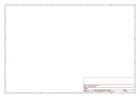
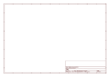

# OOMP Project  
## GeekAmmo_Legacy_Products  by sparkfun  
  
oomp key: oomp_projects_flat_sparkfun_geekammo_legacy_products  
(snippet of original readme)  
  
GeekAmmo Legacy Products  
========================  
Legacy products from GeekAmmo, which is now owned by SparkFun Electronics.  
  
  
Repository Contents  
-------------------  
* **/GMO-00001** - 4 Channel Logic Level Converter  
* **/GMO-00004** - MAGPIE - (Arduino-Compatible) Open Source Electronics Prototyping Platform   
* **/GMO-00030** - RGB 16x2 LCD+Keypad Kit for Raspberry Pi  
  
  
License Information  
-------------------  
The hardware is released under [Creative Commons ShareAlike 4.0 International](https://creativecommons.org/licenses/by-sa/4.0/).  
  
Distributed as-is; no warranty is given.  
  
  full source readme at [readme_src.md](readme_src.md)  
  
source repo at: [https://github.com/sparkfun/GeekAmmo_Legacy_Products](https://github.com/sparkfun/GeekAmmo_Legacy_Products)  
## Board  
  
  
## Schematic  
  
  
  
[schematic pdf](working_schematic.pdf)  
## Images  
  
  
  
  
  
  
  
  
  
  
  
  
  
  
  
  
