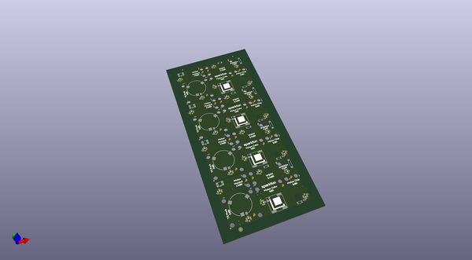
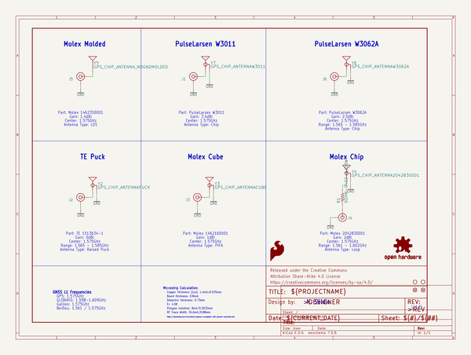
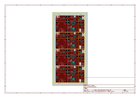
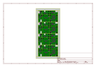
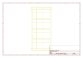
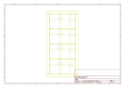
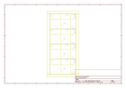

# OOMP Project  
## GNSS_Chip_Antenna_Evaluation_Board  by sparkfun  
  
oomp key: oomp_projects_flat_sparkfun_gnss_chip_antenna_evaluation_board  
(snippet of original readme)  
  
SparkFun GNSS Chip Antenna Evaluation Board  
===========================================================  
  
  
  
[*SparkFun GNSS Chip Antenna Eval Board (GPS-15247)*](https://www.sparkfun.com/products/15247)  
  
The GNSS Chip Evaluation board allows for quick testing of various chip scale GPS and GNSS antennas. Various sizes and manufacturers allow the user to see for themselves how their GPS receiver will preform with each extremely small GPS antenna.  
  
Repository Contents  
-------------------  
  
* **/Documents** - Antenna datasheets  
* **/Hardware** - Eagle files  
  
Documentation  
-------------------  
  
* **[Hookup Guide](https://learn.sparkfun.com/tutorials/gnss-chip-antenna-hookup-guide)** - Basic hookup guide for the antenna evaluation board  
* **[Three Quick Tips About Using U.FL](https://learn.sparkfun.com/tutorials/three-quick-tips-about-using-ufl)** - Quick tips regarding how to connect, protect, and disconnect U.FL connectors  
  
License Information  
-------------------  
  
This product is _**open source**_!   
  
Various bits of the code have different licenses applied. Anything SparkFun wrote is beerware; if you see me (or any other SparkFun employee) at the local, and you've found our code helpful, please buy us a round!  
  
Please use, reuse, and modify these files as you see fit. Please maintain attribution   
  full source readme at [readme_src.md](readme_src.md)  
  
source repo at: [https://github.com/sparkfun/GNSS_Chip_Antenna_Evaluation_Board](https://github.com/sparkfun/GNSS_Chip_Antenna_Evaluation_Board)  
## Board  
  
  
## Schematic  
  
  
  
[schematic pdf](working_schematic.pdf)  
## Images  
  
  
  
  
  
  
  
  
  
  
  
  
  
  
  
  
