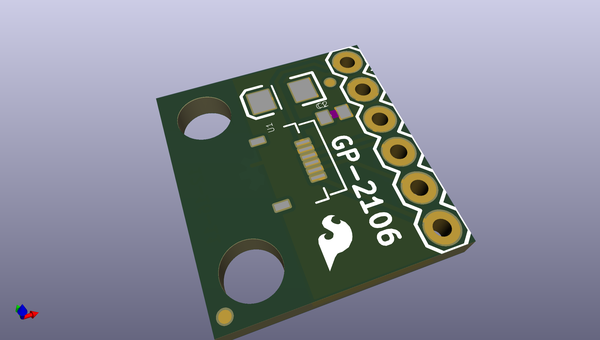
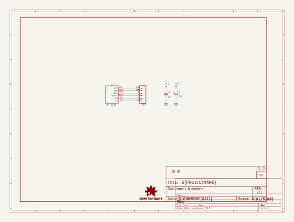
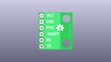
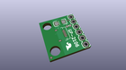
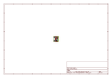
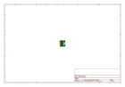
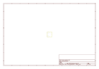
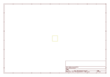

# OOMP Project  
## GP-2106_Breakout  by sparkfun  
  
(snippet of original readme)  
  
**NOTE:** *This product has been retired from our catalog. If you are looking for more up-to-date info, please check out some of these resources to see how other users are still hacking and improving on this product.*  
* *[SparkFun Forum](https://forum.sparkfun.com/)*  
* *[Comments Here on GitHub](https://github.com/sparkfun/GP-2106_Breakout/issues)*  
* *[IRC Channel](https://www.sparkfun.com/news/263)*  
  
SparkFun GP-2106 Breakout  
========================================  
  
  
  
[*SparkFun GP-2106 Breakout (GPS-11073)*](https://www.sparkfun.com/products/11073)  
  
This breakout board gives you access to the little tiny pins on the ribbon connector for the, also tiny, [GP-2106 GPS module](https://www.sparkfun.com/products/retired/10890). All six pins are broken out to standard 0.1" headers.   
Keep in mind the GP-2106 runs on 1.8V and uses 1.8V logic levels.  
  
Repository Contents  
-------------------  
  
* **/Hardware** - Eagle design files (.brd, .sch)  
* **/Production** - Production panel files (.brd)  
  
Documentation  
--------------  
* **[SparkFun Fritzing repo](https://github.com/sparkfun/Fritzing_Parts)** - Fritzing diagrams for SparkFun products.  
* **[SparkFun 3D Model repo](https://github.com/sparkfun/3D_Models)** - 3D models of SparkFun products.   
  
License Information  
-------------------  
This product is _**open source**_!   
  
The **hardware** is released under [Creative Commons ShareAlike 4.0 International  
  full source readme at [readme_src.md](readme_src.md)  
  
source repo at: [https://github.com/sparkfun/GP-2106_Breakout](https://github.com/sparkfun/GP-2106_Breakout)  
## Board  
  
  
## Schematic  
  
  
  
[schematic pdf](working_schematic.pdf)  
## Images  
  
  
  
  
  
  
  
  
  
  
  
  
  
  
  
  
