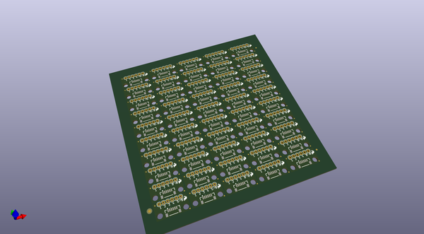
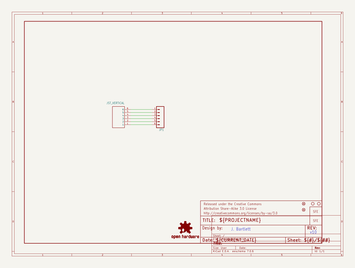
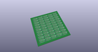
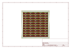
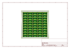
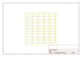
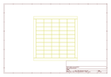
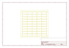

# OOMP Project  
## GPS_Breakout  by sparkfun  
  
(snippet of original readme)  
  
GPS Breakout  
========================================  
  
[    
*GPS Breakout (BOB-11818)*](https://www.sparkfun.com/products/11818)  
  
This is a universal breakout board for any GPS units that interface over 1.0mm JST type cable. This board currently is compatible with the [GP-635T](https://www.sparkfun.com/products/11571), [GP-735](https://www.sparkfun.com/products/13670) [EM406](https://www.sparkfun.com/products/465), and [EM506](https://www.sparkfun.com/products/12751) GPS receviers and the [1 foot](https://www.sparkfun.com/products/9123) and [1.75 inch](https://www.sparkfun.com/products/574) JST cables.  
  
Repository Contents  
-------------------  
* **/Hardware** - All Eagle design files (.brd, .sch)  
* **/Production Files** - Test bed files and production panel files  
  
Documentation  
-------------------  
  
* **[Hookup Guide](https://learn.sparkfun.com/tutorials/gps-basics/all-reading-gps-data)** - Basic hookup guide using the GPS breakout board.  
  
License Information  
-------------------  
The hardware is released under [Creative Commons Share-alike 3.0](http://creativecommons.org/licenses/by-sa/3.0/).    
  
  full source readme at [readme_src.md](readme_src.md)  
  
source repo at: [https://github.com/sparkfun/GPS_Breakout](https://github.com/sparkfun/GPS_Breakout)  
## Board  
  
  
## Schematic  
  
  
  
[schematic pdf](working_schematic.pdf)  
## Images  
  
  
  
  
  
  
  
  
  
  
  
  
  
  
  
  
