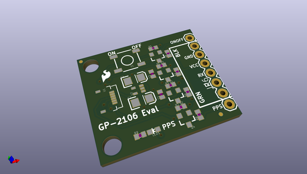
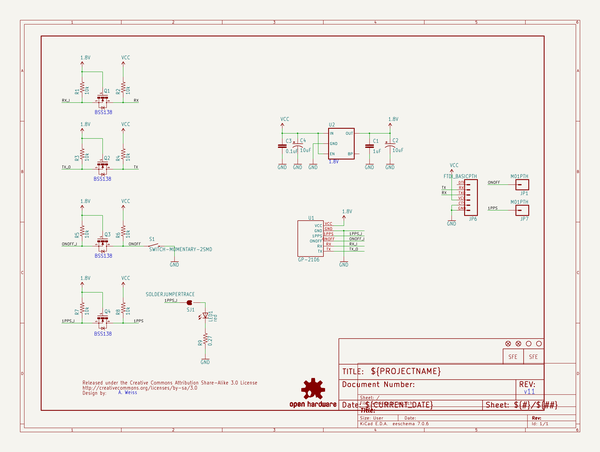
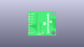
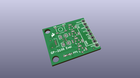
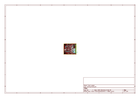
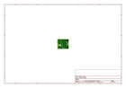
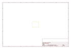
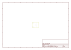
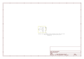

# OOMP Project  
## GPS_Evaluation_Board_GP-2106  by sparkfun  
  
(snippet of original readme)  
  
**NOTE:** *This product has been retired from our catalog. If you are looking for more up-to-date info, please check out some of these resources to see how other users are still hacking and improving on this product.*  
* *[SparkFun Forum](https://forum.sparkfun.com/)*  
* *[Comments Here on GitHub](https://github.com/sparkfun/GPS_Evaluation_Board_GP-2106/issues)*  
* *[IRC Channel](https://www.sparkfun.com/news/263)*  
  
SparkFun GPS Evaluation Board - GP-2106  
========================================  
  
  
  
[*SparkFun GPS Evaluation Board - GP-2106 (GPS-10995)*](https://www.sparkfun.com/products/10995)  
  
The GP-2106 Evaluation Board features everything you need to get the [GP-2106 module](https://www.sparkfun.com/products/retired/10890) talking to your system.   
Because the GP-2106 is a 1.8V module, we’ve provided level-shifting for 3.3 and 5V systems.   
The board also features a PPS status LED, on/off button and an FTDI Basic compatible header!  
  
Repository Contents  
-------------------  
  
* **/Hardware** - Eagle design files (.brd, .sch)  
* **/Production** - Production panel files (.brd)  
  
Documentation  
--------------  
* **[SparkFun Fritzing repo](https://github.com/sparkfun/Fritzing_Parts)** - Fritzing diagrams for SparkFun products.  
* **[SparkFun 3D Model repo](https://github.com/sparkfun/3D_Models)** - 3D models of SparkFun products.   
  
License Information  
-------------------  
This product is   
  full source readme at [readme_src.md](readme_src.md)  
  
source repo at: [https://github.com/sparkfun/GPS_Evaluation_Board_GP-2106](https://github.com/sparkfun/GPS_Evaluation_Board_GP-2106)  
## Board  
  
  
## Schematic  
  
  
  
[schematic pdf](working_schematic.pdf)  
## Images  
  
  
  
  
  
  
  
  
  
  
  
  
  
  
  
  
