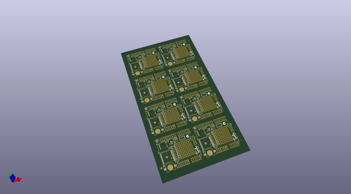
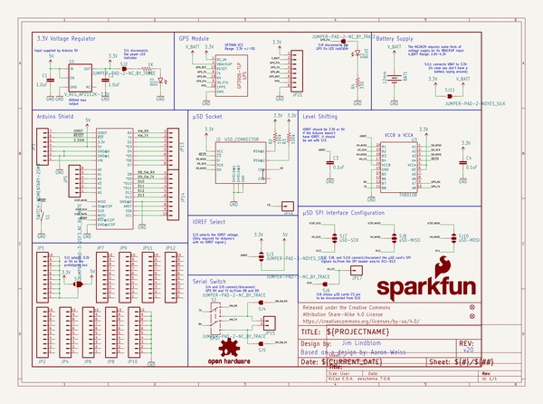
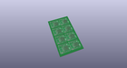
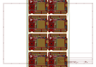
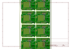
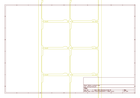
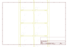
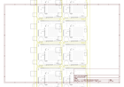

# OOMP Project  
## GPS_Shield  by sparkfun  
  
(snippet of original readme)  
  
SparkFun GPS Logger Shield  
====================  
  
  
  
[*SparkFun GPS Shield (GPS-13750)*](https://www.sparkfun.com/products/13750)  
  
The [SparkFun GPS Logger Shield](https://www.sparkfun.com/products/13750) equips your Arduino with access to a GPS module, µSD memory card socket, and all of the other peripherals you'll need to turn your Arduino into a position-tracking, speed-monitoring, altitude-observing wonder logger. The shield is based around a [GP3906-TLP GPS Module](https://cdn.sparkfun.com/assets/learn_tutorials/4/6/8/GP3906-TLP_DataSheet_Rev_A01.pdf) -- a 66-channel GPS receiver featuring a MediaTek MT3339 architecture and an up to 10Hz update rate.  
  
Repository Contents  
-------------------  
  
* **/Documentation** - Data sheets, additional product information   
* **/Firmware** - Example code   
* **/Hardware** - All Eagle design files (.brd, .sch)  
* **/Production** - Production panel files (.brd)  
  
Documentation  
--------------  
* **[Hookup Guide](https://learn.sparkfun.com/tutorials/gps-logger-shield-hookup-guide)** - Basic hookup guide for the SparkFun GPS Logger Shield.  
  
Product Versions  
----------------  
* [GPS-13750](https://www.sparkfun.com/products/13750)- Initial release of the GPS Logger Shield  
  
Version History  
---------------  
* [V_1.6](https://github.com/sparkfun/GPS_Shield/releases/tag/V_1.6) - Original GPS Shield - older GPS module, no µSD card   
  full source readme at [readme_src.md](readme_src.md)  
  
source repo at: [https://github.com/sparkfun/GPS_Shield](https://github.com/sparkfun/GPS_Shield)  
## Board  
  
  
## Schematic  
  
  
  
[schematic pdf](working_schematic.pdf)  
## Images  
  
  
  
  
  
  
  
  
  
  
  
  
  
  
  
  
