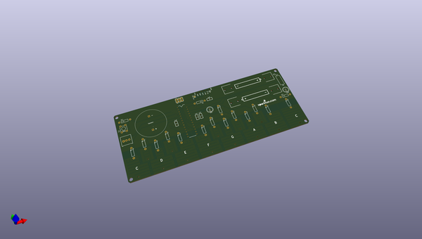
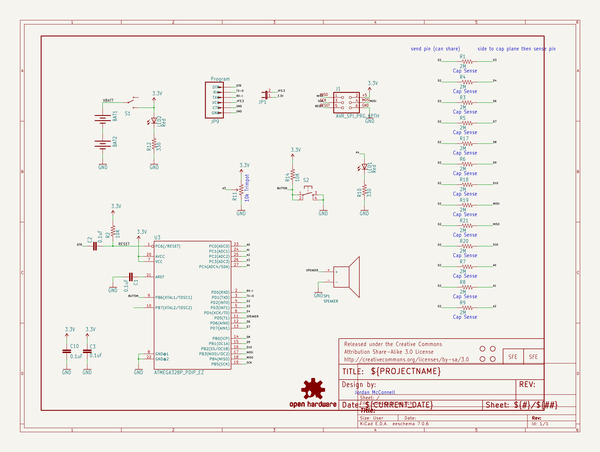
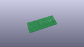
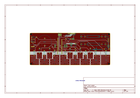
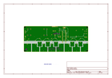
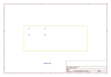
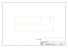
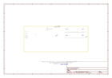

# OOMP Project  
## Gram_Piano  by sparkfun  
  
(snippet of original readme)  
  
**NOTE:** *This product has been retired from our catalog. If you are looking for more up-to-date info, please check out some of these resources to see how other users are still hacking and improving on this product.*  
  
* *[SparkFun Forum](https://forum.sparkfun.com/)*  
* *[IRC Channel](https://www.sparkfun.com/news/263)*  
  
Gram Piano  
========================================  
  
   
[*Gram Piano Kit (KIT-11835)*](https://www.sparkfun.com/products/11835)  
  
The Gram Piano is a capacitive touch keyboard and soldering kit that allows you to   
create and play all the notes of the C major scale and outputs sound through a   
PCB Speaker. A different octave can be selected with the potentiometer. Pressing  
the on board button will start/stop playing a melody. Feel free to adapt the keys to  
play other notes/scales/melodies or perform tasks as you see fit.  
  
This board was created in Eagle v6.0.5, this firmware was created in Arduino v1.5.2  
  
Repository Contents  
-------------------  
  
* **/Firmware** - Firmware the board ships with.  
* **/Hardware** - All Eagle design files (.brd, .sch, .STL)  
* **/Production** - Test bed files and production panel files  
  
Documentation  
--------------  
* **[Hookup Guide](https://learn.sparkfun.com/tutorials/gram-piano-assembly-guide)** - Basic hookup guide for the  Gram Piano.  
  
Product Versions  
----------------  
* [KIT-11835 (RETIRED)](https://www.spa  
  full source readme at [readme_src.md](readme_src.md)  
  
source repo at: [https://github.com/sparkfun/Gram_Piano](https://github.com/sparkfun/Gram_Piano)  
## Board  
  
  
## Schematic  
  
  
  
[schematic pdf](working_schematic.pdf)  
## Images  
  
  
  
  
  
  
  
  
  
  
  
  
  
  
  
  
