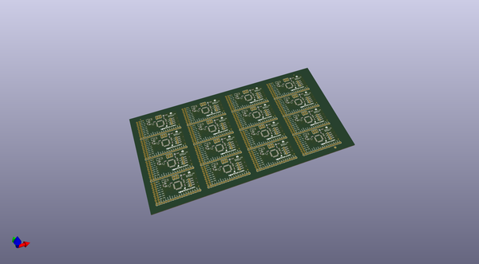
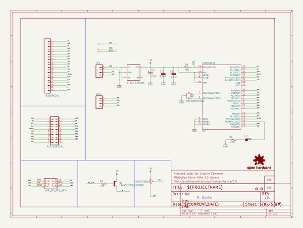
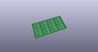
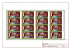
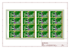
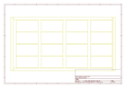
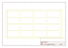
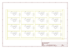

# OOMP Project  
## GraphicLCD_Serial_Backpack  by sparkfun  
  
oomp key: oomp_projects_flat_sparkfun_graphiclcd_serial_backpack  
(snippet of original readme)  
  
Graphic LCD Serial Backpack  
============================  
[  
*Graphic LCD Serial Backpack(LCD-09352)*](https://www.sparkfun.com/products/9352)  
  
The Graphic LCD Serial Backpack interfaces to either the [160x128 pixel Huge Graphic LCD](https://www.sparkfun.com/products/8799) or  
the [128x64 pixel display](https://www.sparkfun.com/products/710). The backpack will allow you to write text, draw lines, circles and boxes,   
set and reset individual pixels, and erase specific blocks of the display.   
  
Repository Contents  
-------------------  
* **/Firmware** - The firmware that comes installed on the backpack  
* **/Hardware** - All Eagle design files (.brd, .sch)  
  
  
Product Versions  
----------------  
* [LCD-09352](https://www.sparkfun.com/products/9352)- Graphic Serial LCD Backpack by itself  
* [LCD-09351](https://www.sparkfun.com/products/9351) - Serial Graphic LCD 128x64 (LCD + backpack)  
* [LCD-08884](https://www.sparkfun.com/products/8884) - Serial Graphic LCD 160x128 (LCD + backpack)  
  
License Information  
-------------------  
The hardware is released under [Creative Commons Share-alike 3.0](http://creativecommons.org/licenses/by-sa/3.0/).    
All other code is open source so please feel free to do anything you want with it; you buy me a beer if you use this and we meet someday ([Beerware license](http://en.wikipedia.org/wiki/Beerware)).  
  
  full source readme at [readme_src.md](readme_src.md)  
  
source repo at: [https://github.com/sparkfun/GraphicLCD_Serial_Backpack](https://github.com/sparkfun/GraphicLCD_Serial_Backpack)  
## Board  
  
  
## Schematic  
  
  
  
[schematic pdf](working_schematic.pdf)  
## Images  
  
  
  
  
  
  
  
  
  
  
  
  
  
  
  
  
