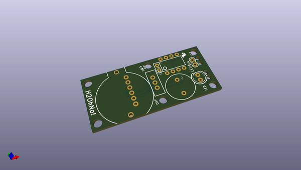
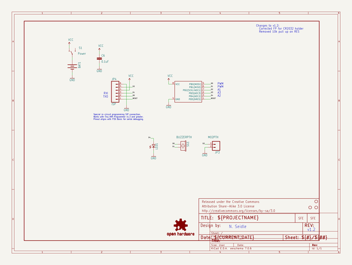
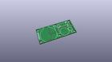
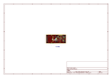
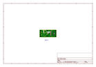
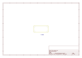
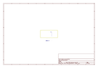
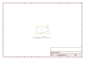

# OOMP Project  
## H2OhNo  by sparkfun  
  
oomp key: oomp_projects_flat_sparkfun_h2ohno  
(snippet of original readme)  
  
  
**Note:Retired Product**  
This product has been retired from our catalog and is no longer for sale. This page is made available for those looking for datasheets and the simply curious.  
  
H2OhNo  
======  
  
  
[   
*H20hNo (DEV-12069)*](https://www.sparkfun.com/products/12069)  
  
H2OhNo! is a small ATtiny development board that detects the presence of water and sets off an alarm.  
  
  
Repository Contents  
-------------------  
  
* **/Firmware** - Example firmware for running the sensor  
* **/Hardware** - All Eagle design files (.brd, .sch)  
  
  
Documentation  
-------------------  
* **[Hookup Guide](https://learn.sparkfun.com/tutorials/h2ohno)** - Basic hookup guide for the H2OhNo  
  
   
License Information  
-------------------  
The hardware is released under [Creative Commons Share-alike 3.0](http://creativecommons.org/licenses/by-sa/3.0/).    
All other code is open source so please feel free to do anything you want with it; you buy me a beer if you use this and we meet someday ([Beerware license](http://en.wikipedia.org/wiki/Beerware)).  
  
  full source readme at [readme_src.md](readme_src.md)  
  
source repo at: [https://github.com/sparkfun/H2OhNo](https://github.com/sparkfun/H2OhNo)  
## Board  
  
  
## Schematic  
  
  
  
[schematic pdf](working_schematic.pdf)  
## Images  
  
  
  
  
  
  
  
  
  
  
  
  
  
  
  
  
