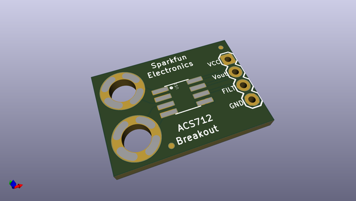
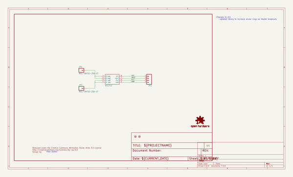
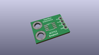
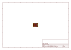
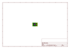
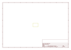
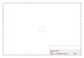
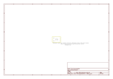

# OOMP Project  
## Hall-Effect_Current_Sensor_Breakout-ACS712  by sparkfun  
  
oomp key: oomp_projects_flat_sparkfun_hall_effect_current_sensor_breakout_acs712  
(snippet of original readme)  
  
**NOTE:** *This product has been retired from our catalog. There is an updated drop-in replacement with the ACS723 available: [SEN-13679](https://github.com/sparkfun/Current_Sensor_Breakout-ACS723). If you are looking for more up-to-date info, please check out some of these resources to see how other users are still hacking and improving on this product version.*  
  
* *[SparkFun Forum](https://forum.sparkfun.com/)*  
* *[Comments Here on GitHub](https://github.com/sparkfun/Hall-Effect_Current_Sensor_Breakout-ACS712/issues)*  
* *[IRC Channel](https://www.sparkfun.com/news/263)*  
  
SparkFun Hall-Effect Current Sensor Breakout - ACS712  
=====================================================  
  
  
  
[*SparkFun Hall-Effect Current Sensor Breakout - ACS712 (BOB-08882)*](https://www.sparkfun.com/products/8882)  
  
This is a breakout board for the fully integrated Hall Effect based linear ACS712 current sensor.   
The sensor gives precise current measurement for both AC and DC signals.  
  
Repository Contents  
-------------------  
* **/Hardware** - All Eagle design files (.brd, .sch)  
  
Documentation  
--------------  
* **[Hookup Guide](https://learn.sparkfun.com/tutorials/acs712-low-current-sensor-hookup-guide)** - Basic hookup guide for the ACS712 Current Sensor Breakout.  
  
Version History  
---------------  
* [V1.1](https://github.com/sparkfun/Hall-Effect_Current_Sensor_Breakout-ACS712/tags) - Init  
  full source readme at [readme_src.md](readme_src.md)  
  
source repo at: [https://github.com/sparkfun/Hall-Effect_Current_Sensor_Breakout-ACS712](https://github.com/sparkfun/Hall-Effect_Current_Sensor_Breakout-ACS712)  
## Board  
  
  
## Schematic  
  
  
  
[schematic pdf](working_schematic.pdf)  
## Images  
  
  
  
  
  
  
  
  
  
  
  
  
  
  
  
  
