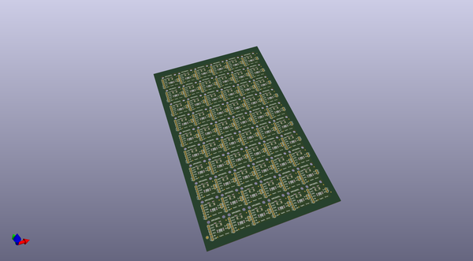
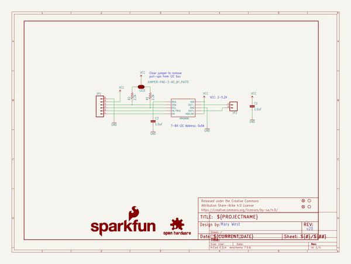

# OOMP Project  
## Haptic_Motor_Driver  by sparkfun  
  
(snippet of original readme)  
  
SparkFun Haptic Motor Driver  
========================================  
  
  
	  
[*SparkFun Haptic Motor Driver (ROB-14538)*](https://www.sparkfun.com/products/14538)  
	  
Ready to add some good vibes to your project? Look no further than the SparkFun Haptic Motor Driver. This board breaks out Texas Instruments' DRV2605L Haptic Motor Driver, which adds meaningful feedback from your devices using the breakout and an Arduino-compatible device.  
  
The DRV2605L is capable of driving two different types of motors, ERM and LRA. It is important to know, however, that the default firmware for the DRV2605L is set for use with ERM type motors. We have created an Arduino library that makes the DRV2605L easy to use with six different ERM effects and one LRA effect.  
	  
The SparkFun Haptic Motor Driver breakout board features six pins to provide power to the sensor and I2C bus. Additionally, a microcontroller that supports I2C is required to communicate with the DRV2605L and relay the data to the user by means of vibration.  
  
Repository Contents	  
---------------	  
  
* **/Documentation** - Data sheets, additional product information, ZIP folder containing all project files and a ZIP folder containing libraries and example code   
* **/Hardware** - Eagle design files (.brd, .sch)  
* **/Libraries** - Libraries for use with the Haptic Motor Driver with some example projects   
* **/Pr  
  full source readme at [readme_src.md](readme_src.md)  
  
source repo at: [https://github.com/sparkfun/Haptic_Motor_Driver](https://github.com/sparkfun/Haptic_Motor_Driver)  
## Board  
  
  
## Schematic  
  
  
  
[schematic pdf](working_schematic.pdf)  
## Images  
  
  
  
  
  
  
  
  
  
  
  
  
  
  
  
  
