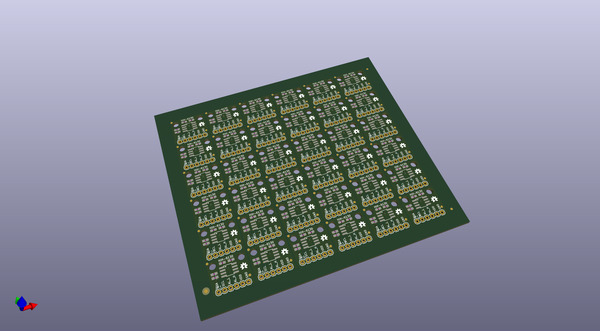
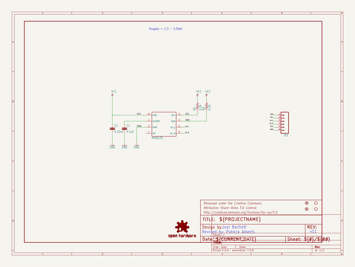
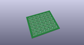
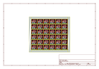
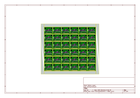
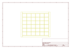
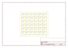

# OOMP Project  
## HIH6130_Breakout  by sparkfun  
  
(snippet of original readme)  
  
HIH6130 Breakout - Humidity and Temperature Sensor  
===================================================  
  
[  
*HIH6130 Breakout (SEN-11295)*](https://www.sparkfun.com/products/11295)  
  
This is a breakout for the HIH6130 digital output-type relative humidity and temperature sensor.  
  
Repository Contents  
-------------------  
* **/Hardware** - All Eagle design files (.brd, .sch, .STL)  
* **/Production** - Test bed files and production panel files  
  
  
License Information  
-------------------  
The hardware is released under [Creative Commons ShareAlike 4.0 International](https://creativecommons.org/licenses/by-sa/4.0/).  
  
Distributed as-is; no warranty is given.  
  
  full source readme at [readme_src.md](readme_src.md)  
  
source repo at: [https://github.com/sparkfun/HIH6130_Breakout](https://github.com/sparkfun/HIH6130_Breakout)  
## Board  
  
  
## Schematic  
  
  
  
[schematic pdf](working_schematic.pdf)  
## Images  
  
  
  
  
  
  
  
  
  
  
  
  
  
  
  
  
