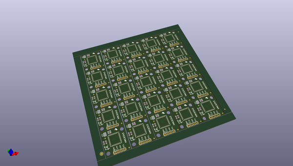
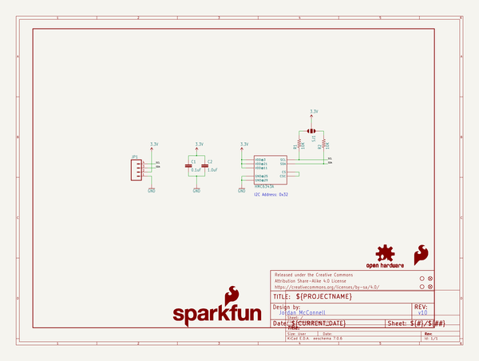
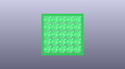
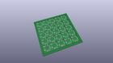
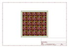
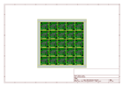
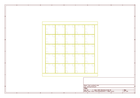
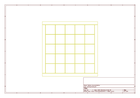
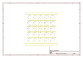

# OOMP Project  
## HMC6343_Breakout  by sparkfun  
  
(snippet of original readme)  
  
SparkFun HMC6343 Breakout  
=========================  
  
  
  
[*SparkFun HMC6343 Breakout (SEN-12916)*](https://www.sparkfun.com/products/12916)  
  
A Breakout Board for the high end HMC6343 magnetometer.  
The HMC6343 is a fully integrated high end electronic compass module that can compute and give you a heading direction that’s accurate within a couple degrees.  
  
Repository Contents  
-------------------  
* **/Hardware** - All Eagle design files (.brd, .sch)  
* **/Production** - Test bed files and production panel files  
  
  
Documentation  
--------------  
* **[Library](https://github.com/sparkfun/SparkFun_HMC6343_Arduino_Library)** - Arduino library for the HMC6343.  
* **[Hookup Guide](https://learn.sparkfun.com/tutorials/hmc6343-3-axis-compass-hookup-guide)** - Basic hookup guide for the HMC6343.  
* **[SparkFun Fritzing repo](https://github.com/sparkfun/Fritzing_Parts)** - Fritzing diagrams for SparkFun products.  
* **[SparkFun 3D Model repo](https://github.com/sparkfun/3D_Models)** - 3D models of SparkFun products.   
* **[SparkFun Graphical Datasheets](https://github.com/sparkfun/Graphical_Datasheets)** -Graphical Datasheets for various SparkFun products.  
  
  
Version History  
---------------  
  
* [v_H1.0_L1.1.0](https://github.com/sparkfun/HMC6343_Breakout/tree/v_H1.0_L1.1.0) - Hardware version 1.0, library version 1.1.0. Compatible with Arduino 1.6+   
* [vH10F10](http  
  full source readme at [readme_src.md](readme_src.md)  
  
source repo at: [https://github.com/sparkfun/HMC6343_Breakout](https://github.com/sparkfun/HMC6343_Breakout)  
## Board  
  
  
## Schematic  
  
  
  
[schematic pdf](working_schematic.pdf)  
## Images  
  
  
  
  
  
  
  
  
  
  
  
  
  
  
  
  
