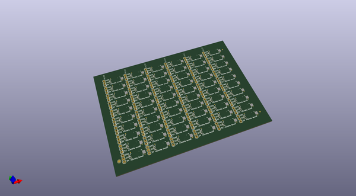
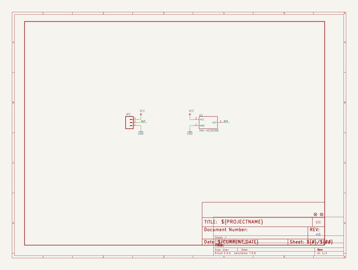

# OOMP Project  
## Humidity_Sensor_Breakout-HIH-4030  by sparkfun  
  
(snippet of original readme)  
  
SparkFun Humidity Sensor Breakout - HIH-4030  
========================================  
  
  
  
[*SparkFun Humidity Sensor Breakout - HIH-4030 (SEN-09569)*](https://www.sparkfun.com/products/9569)  
  
This is a breakout board for Honeywell’s HIH-4030 humidity sensor.   
The HIH-4030 measures relative humidity (%RH) and delivers it as an analog output voltage.   
  
Repository Contents  
-------------------  
  
* **/Hardware** - Eagle design files (.brd, .sch)  
* **/Production** - Production panel files (.brd)  
  
Documentation  
--------------  
* **[SparkFun Fritzing repo](https://github.com/sparkfun/Fritzing_Parts)** - Fritzing diagrams for SparkFun products.  
* **[SparkFun 3D Model repo](https://github.com/sparkfun/3D_Models)** - 3D models of SparkFun products.   
  
  
License Information  
-------------------  
This product is _**open source**_!   
  
The **hardware** is released under [Creative Commons ShareAlike 4.0 International](https://creativecommons.org/licenses/by-sa/4.0/).  
  
Please use, reuse, and modify these files as you see fit. Please maintain attribution to SparkFun Electronics and release anything derivative under the same license.  
  
Distributed as-is; no warranty is given.  
  
- Your friends at SparkFun.  
  
  
  
  full source readme at [readme_src.md](readme_src.md)  
  
source repo at: [https://github.com/sparkfun/Humidity_Sensor_Breakout-HIH-4030](https://github.com/sparkfun/Humidity_Sensor_Breakout-HIH-4030)  
## Board  
  
  
## Schematic  
  
  
  
[schematic pdf](working_schematic.pdf)  
## Images  
