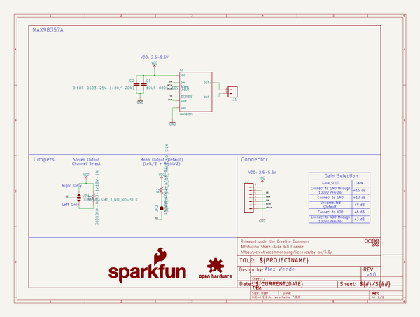

# OOMP Project  
## I2S_Audio_Breakout  by sparkfun  
  
oomp key: oomp_projects_flat_sparkfun_i2s_audio_breakout  
(snippet of original readme)  
  
SparkFun I2S Audio Breakout  
========================================  
  
  
  
[*I2S Audio Breakout (DEV-14809)*](https://www.sparkfun.com/products/14809)  
  
The I2S Audio Breakout board uses the MAX98357A digital to analog converter (DAC), which converts I2S (not be confused with I2C) audio to an analog signal to drive speakers. The MAX98357A has a built in class D amplifier which can deliver up to 3.2W of power into a 4Ω load. To use this board, all you need is a speaker and a microcontroller that supports I2S. I2S is currently supported on our [SAMD21 Dev Breakout](https://www.sparkfun.com/products/13672), [SAMD21 Mini](https://www.sparkfun.com/products/13664), [ESP8266 Thing](https://www.sparkfun.com/products/13231), and [ESP32 Thing](https://www.sparkfun.com/products/13907) boards.  
  
Repository Contents  
-------------------  
  
* **/Hardware** - Eagle design files (.brd, .sch)  
* **/Production** - Production panel files (.brd)  
  
Documentation  
--------------  
* **[Hookup Guide](https://learn.sparkfun.com/tutorials/i2s-audio-breakout-hookup-guide)** - Basic hookup guide for the I2S Audio Breakout.  
  
License Information  
-------------------  
  
This product is _**open source**_!   
  
Please review the LICENSE.md file for license information.   
  
If you have any questions or concerns on licensing, please contact techsupport@sparkfun.com.  
  
Distributed as-is; no warranty is given.  
  
- Your frien  
  full source readme at [readme_src.md](readme_src.md)  
  
source repo at: [https://github.com/sparkfun/I2S_Audio_Breakout](https://github.com/sparkfun/I2S_Audio_Breakout)  
## Board  
  
  
## Schematic  
  
  
  
[schematic pdf](working_schematic.pdf)  
## Images  
  
  
  
  
  
  
  
  
  
  
  
  
  
  
  
  
