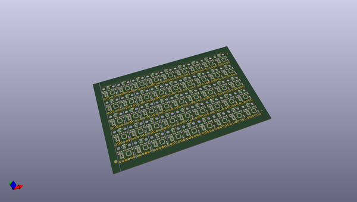
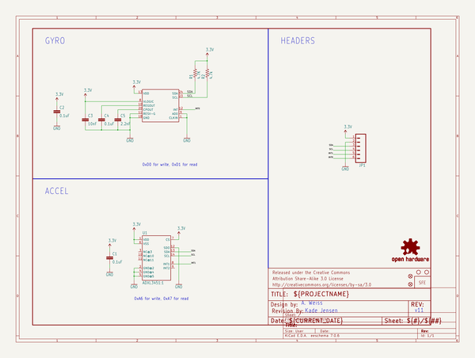
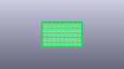
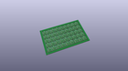
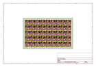
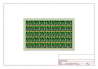
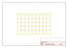
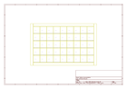
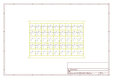

# OOMP Project  
## IMU_Digital_Combo_Board  by sparkfun  
  
oomp key: oomp_projects_flat_sparkfun_imu_digital_combo_board  
(snippet of original readme)  
  
IMU Digital Combo Board-6 Degrees of Freedom-ITG3200/ADXL345  
====================================================================  
[  
*IMU Digital Combo (SEN-10121)*](https://www.sparkfun.com/products/10121)  
  
A simple breakout for the ADXL345 accelerometer and the ITG-3200 MEMS gyro. This board communicates over I2C.   
  
Repository Contents  
-------------------  
* **/Hardware** - All Eagle design files (.brd, .sch)  
* **/Libraries** - All Arduino libraries and board examples  
* **/Production** - Test bed files and production panel files  
  
  
License Information  
-------------------  
The hardware is released under [Creative Commons ShareAlike 4.0 International](https://creativecommons.org/licenses/by-sa/4.0/).  
The code is beerware; if you see me (or any other SparkFun employee) at the local, and you've found our code helpful, please buy us a round!  
  
Distributed as-is; no warranty is given.  
  
  
The original code library can be found [here](https://github.com/a1ronzo/6DOF-Digital).   
  full source readme at [readme_src.md](readme_src.md)  
  
source repo at: [https://github.com/sparkfun/IMU_Digital_Combo_Board](https://github.com/sparkfun/IMU_Digital_Combo_Board)  
## Board  
  
  
## Schematic  
  
  
  
[schematic pdf](working_schematic.pdf)  
## Images  
  
  
  
  
  
  
  
  
  
  
  
  
  
  
  
  
