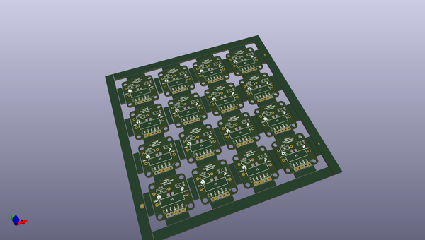
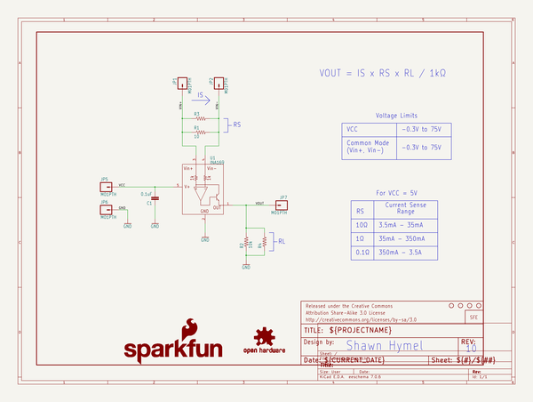
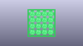
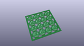
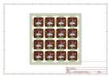
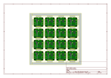
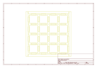
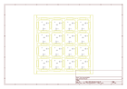

# OOMP Project  
## INA169_Breakout  by sparkfun  
  
(snippet of original readme)  
  
SparkFun INA169 Current Sensing Breakout  
===============  
  
[    
*INA169 Current Sense Breakout Board (SEN-12040)*](https://www.sparkfun.com/products/12040)  
  
High-side current sense breakout board. [The datasheet can be found here.](http://www.ti.com/lit/ds/symlink/ina169.pdf)  
  
This part was created in Eagle v6.0.0. Example sketches were created in Arduino v1.0.5.  
  
Repository Contents  
-------------------  
  
* **/Firmware** - Example Arduino sketches  
* **/Hardware** - All Eagle design files (.brd, .sch, .STL)  
* **/Production** - Test bed files and production panel files  
  
Documentation  
-------------------  
* **[Hookup Guide](https://learn.sparkfun.com/tutorials/ina169-breakout-board-hookup-guide)**  
  
Version History  
---------------  
* **v1.0** Initial release  
  
License Information  
-------------------  
The hardware is released under [Creative Commons Share-alike 3.0](http://creativecommons.org/licenses/by-sa/3.0/).    
All other code is open source so please feel free to do anything you want with it; you buy me a beer if you use this and we meet someday ([Beerware license](http://en.wikipedia.org/wiki/Beerware)).  
  
  
  full source readme at [readme_src.md](readme_src.md)  
  
source repo at: [https://github.com/sparkfun/INA169_Breakout](https://github.com/sparkfun/INA169_Breakout)  
## Board  
  
  
## Schematic  
  
  
  
[schematic pdf](working_schematic.pdf)  
## Images  
  
  
  
  
  
  
  
  
  
  
  
  
  
  
  
  
