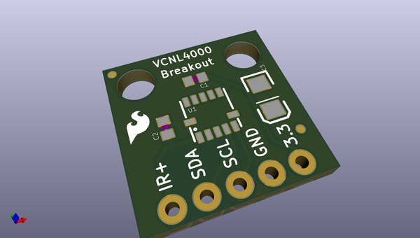
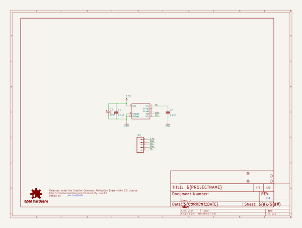
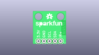
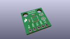
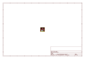
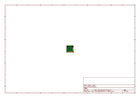
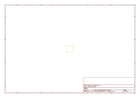
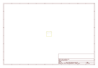
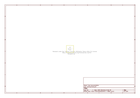

# OOMP Project  
## Infrared_Proximity_Breakout-VCNL4000  by sparkfun  
  
oomp key: oomp_projects_flat_sparkfun_infrared_proximity_breakout_vcnl4000  
(snippet of original readme)  
  
**NOTE:** *This product has been retired from our catalog. If you are looking for more up-to-date info, please check out some of these resources to see how other users are still hacking and improving on this product.*  
* *[SparkFun Forum](https://forum.sparkfun.com/)*  
* *[Comments Here on GitHub](https://github.com/sparkfun/Infrared_Proximity_Breakout-VCNL4000/issues)*  
  
SparkFun Infrared Proximity Breakout - VCNL4000  
========================================  
  
  
  
[*SparkFun Infrared Proximity Breakout - VCNL4000 (BOB-10901)*](https://www.sparkfun.com/products/10901)  
  
The VCNL4000 can detect its proximity to an object using IR within a range of about 20cm.   
Proximity data as well as ambient light level data can be collected over an I2C interface.  
  
Repository Contents  
-------------------  
  
* **/Firmware** - Example Arduino code   
* **/Hardware** - Eagle design files (.brd, .sch)  
* **/Production** - Production panel files (.brd)  
  
Documentation  
--------------  
* **[SparkFun Fritzing repo](https://github.com/sparkfun/Fritzing_Parts)** - Fritzing diagrams for SparkFun products.  
* **[SparkFun 3D Model repo](https://github.com/sparkfun/3D_Models)** - 3D models of SparkFun products.   
  
License Information  
-------------------  
This product is _**open source**_!   
  
The **hardware** is released under [Creative Commons ShareAlike 4.0 International](https://creativecommons.org/licenses/by-s  
  full source readme at [readme_src.md](readme_src.md)  
  
source repo at: [https://github.com/sparkfun/Infrared_Proximity_Breakout-VCNL4000](https://github.com/sparkfun/Infrared_Proximity_Breakout-VCNL4000)  
## Board  
  
  
## Schematic  
  
  
  
[schematic pdf](working_schematic.pdf)  
## Images  
  
  
  
  
  
  
  
  
  
  
  
  
  
  
  
  
