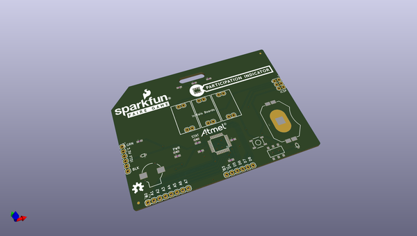
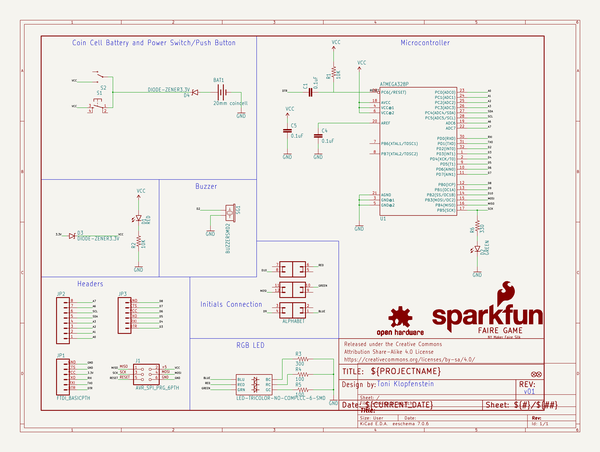

# OOMP Project  
## Interactive_Badges  by sparkfun  
  
(snippet of original readme)  
  
Interactive Badges  
==================  
   
   
 These badges were designed as a soldering demo for the SparkFun booths at Maker Faire. They were designed to teach the basics of PTH soldering, as well as to provide users with an Arduino platform they could take home and hack.  
   
 Please view the [tutorial on hacking your badge](https://learn.sparkfun.com/tutorials/hacking-your-maker-faire-badge) for more information.   
   
 Repository Contents  
-------------------  
  
* **/Firmware** - Any firmware that the part ships with,   
* **/Hardware** - All Eagle design files (.brd, .sch, .STL)  
* **/Production** - Test bed files and production panel files  
*   
License Information  
-------------------  
The hardware is released under [Creative Commons ShareAlike 4.0 International](https://creativecommons.org/licenses/by-sa/4.0/).  
The code is beerware; if you see me (or any other SparkFun employee) at the local, and you've found our code helpful, please buy us a round!  
  
Distributed as-is; no warranty is given.  
  
  full source readme at [readme_src.md](readme_src.md)  
  
source repo at: [https://github.com/sparkfun/Interactive_Badges](https://github.com/sparkfun/Interactive_Badges)  
## Board  
  
  
## Schematic  
  
  
  
[schematic pdf](working_schematic.pdf)  
## Images  
