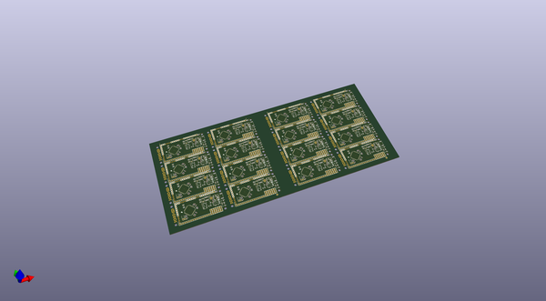
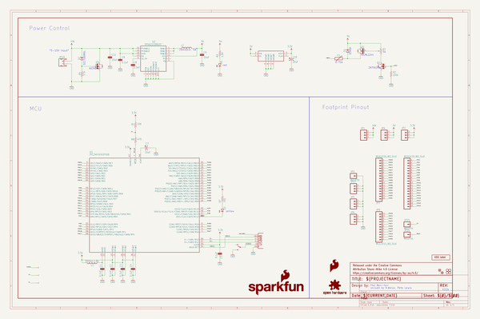
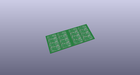
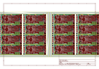
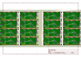
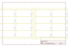
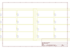
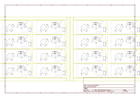

# OOMP Project  
## IOIO-OTG  by sparkfun  
  
oomp key: oomp_projects_flat_sparkfun_ioio_otg  
(snippet of original readme)  
  
IOIO-OTG  
========  
  
  
  
[*IOIO-OTG (DEV-11343)*](https://www.sparkfun.com/products/11343)  
  
The IOIO-OTG is a development board specifically designed for advanced hardware I/O capapbilities to your Android or PC application.  
This board also allows the user to leverage USB On-The-Go specification to connect as a host or as an accessory.   
  
Repository Contents  
-------------------  
* **/Hardware** - All Eagle design files (.brd, .sch, .STL)  
* **/Production** - Test bed files and production panel files  
  
Documentation  
--------------  
  
* **[Hookup Guide](https://learn.sparkfun.com/tutorials/ioio-otg-hookup-guide)** - Basic hookup guide for the IOIO-OTG.  
* **[SparkFun Fritzing repo](https://github.com/sparkfun/Fritzing_Parts)** - Fritzing diagrams for SparkFun products.  
* **[SparkFun 3D Model repo](https://github.com/sparkfun/3D_Models)** - 3D models of SparkFun products.   
* **[SparkFun Graphical Datasheets](https://github.com/sparkfun/Graphical_Datasheets)** -Graphical Datasheets for various SparkFun products.  
  
Product Versions  
----------------  
* [v22b](https://www.sparkfun.com/products/13613)- Version 2.2b. Currently for sale.  
* [v21] (https://www.sparkfun.com/products/retired/12633)- Version 2.1. Retired.  
  
Version History  
---------------  
* [v2.2b](https://github.com/sparkfun/IOIO-OTG/tree/V_2.2b) - GitHub files v2.2b  
* [v2.1](https://github.com/sparkfun/IOIO-OTG/tree/V_2.1) - GitHub files v2.1  
  
License Information  
  full source readme at [readme_src.md](readme_src.md)  
  
source repo at: [https://github.com/sparkfun/IOIO-OTG](https://github.com/sparkfun/IOIO-OTG)  
## Board  
  
  
## Schematic  
  
  
  
[schematic pdf](working_schematic.pdf)  
## Images  
  
  
  
  
  
  
  
  
  
  
  
  
  
  
  
  
