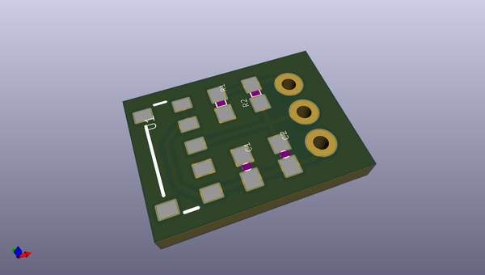
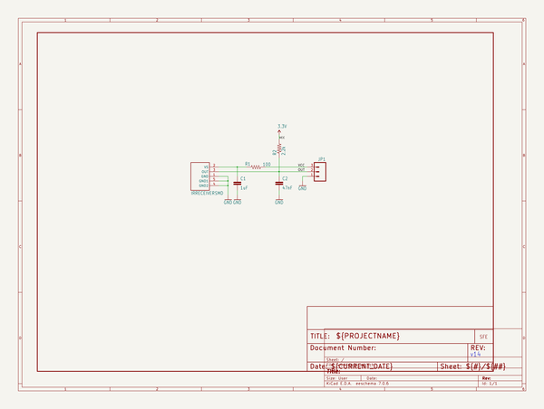
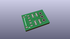
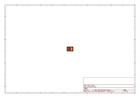
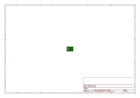
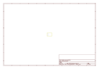
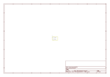

# OOMP Project  
## IR_Receiver_Breakout  by sparkfun  
  
oomp key: oomp_projects_flat_sparkfun_ir_receiver_breakout  
(snippet of original readme)  
  
**NOTE:** *This product has been retired from our catalog. If you are looking for more up-to-date info, please check out some of these resources to see how other users are still hacking and improving on this product.*  
* *[SparkFun Forum](https://forum.sparkfun.com/)*  
* *[Comments Here on GitHub](https://github.com/sparkfun/IR_Receiver_Breakout/issues)*  
* *[IRC Channel](https://www.sparkfun.com/news/263)*  
  
SparkFun IR Receiver Breakout - TSOP85  
========================================  
  
  
  
[*SparkFun IR Receiver Breakout - TSOP85 (SEN-08554)*](https://www.sparkfun.com/products/8554)  
  
This is a very small infrared receiver based on the TSOP85 receiver from Vishay. This receiver has all the filtering and 38kHz demodulation built into the unit.  
  
Repository Contents  
-------------------  
* **/Firmware** - Example code   
* **/Hardware** - All Eagle design files (.brd, .sch)  
  
Documentation  
--------------  
* **[Installing an Arduino Library Guide](https://learn.sparkfun.com/tutorials/installing-an-arduino-library)** - Basic information on how to install an Arduino library.  
* **[Library](https://github.com/z3t0/Arduino-IRremote)** - Library library for the IR Control Kit.  
* **[IR Communication](https://learn.sparkfun.com/tutorials/ir-communication)** - General tutorial for IR communication.  
* **[Hookup Guide](https://learn.sparkfun.com/tutorials/ir-control-kit-hookup-guide)** - Basic hookup  
  full source readme at [readme_src.md](readme_src.md)  
  
source repo at: [https://github.com/sparkfun/IR_Receiver_Breakout](https://github.com/sparkfun/IR_Receiver_Breakout)  
## Board  
  
  
## Schematic  
  
  
  
[schematic pdf](working_schematic.pdf)  
## Images  
  
  
  
  
  
  
  
  
  
  
  
  
  
  
  
  
