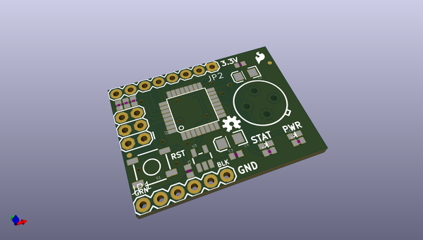
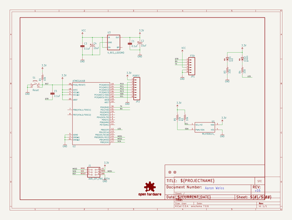
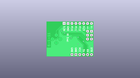
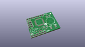
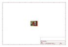
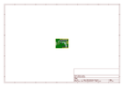
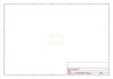
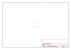
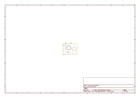

# OOMP Project  
## IR_Thermometer_Evaluation_Board-MLX90614  by sparkfun  
  
oomp key: oomp_projects_flat_sparkfun_ir_thermometer_evaluation_board_mlx90614  
(snippet of original readme)  
  
SparkFun IR Thermometer Evaluation Board - MLX90614  
========================================  
  
  
  
[*SparkFun IR Thermometer Evaluation Board - MLX90614 (SEN-10740)*](https://www.sparkfun.com/products/10740)  
  
The MLX9061 sensor is a high precision, small size, single zone IR thermometer with an optional SMBus (two-wire) or PWM interface.   
The ATMega328 comes with demo code that gives a temperature readout in degrees F at 38400bps.   
You can use a 3.3V FTDI Basic to connect to the board.  
  
Repository Contents  
-------------------  
  
* **/Firmware** - Example code   
* **/Hardware** - Eagle design files (.brd, .sch)  
* **/Production** - Production panel files (.brd)  
* **/Libraries** - Arduino library  
  
Documentation  
--------------  
* **[SparkFun Fritzing repo](https://github.com/sparkfun/Fritzing_Parts)** - Fritzing diagrams for SparkFun products.  
* **[SparkFun 3D Model repo](https://github.com/sparkfun/3D_Models)** - 3D models of SparkFun products.   
  
License Information  
-------------------  
This product is _**open source**_!   
  
The **hardware** is released under [Creative Commons ShareAlike 4.0 International](https://creativecommons.org/licenses/by-sa/4.0/).  
  
The **code** is beerware; if you see me (or any other SparkFun employee) at the local, and you've found our code helpful, please buy us a round!  
  
Please use, reuse, and modify these files as you see fit. Please maintain at  
  full source readme at [readme_src.md](readme_src.md)  
  
source repo at: [https://github.com/sparkfun/IR_Thermometer_Evaluation_Board-MLX90614](https://github.com/sparkfun/IR_Thermometer_Evaluation_Board-MLX90614)  
## Board  
  
  
## Schematic  
  
  
  
[schematic pdf](working_schematic.pdf)  
## Images  
  
  
  
  
  
  
  
  
  
  
  
  
  
  
  
  
