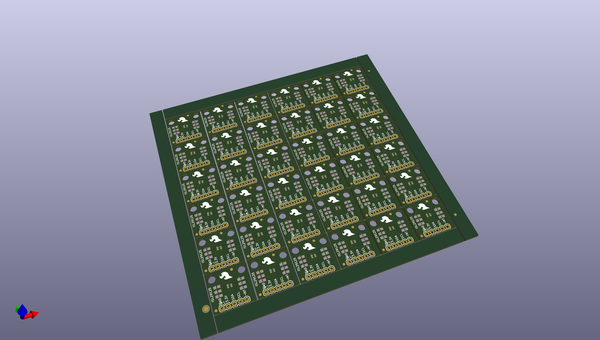
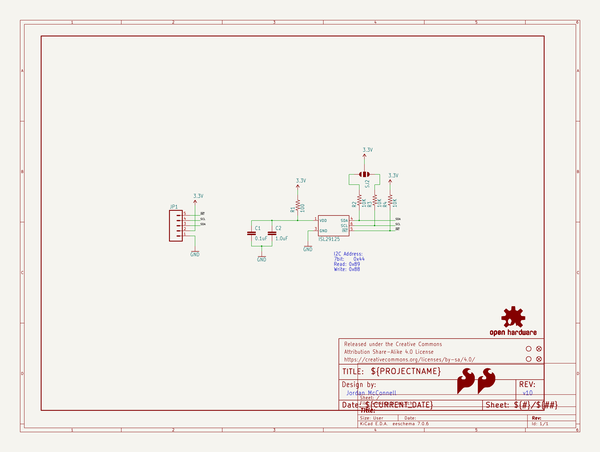

# OOMP Project  
## ISL29125_Breakout  by sparkfun  
  
(snippet of original readme)  
  
SparkFun ISL29125 Breakout  
========================  
  
     
  
[*RGB Light Sensor Breakout-ISL29125 (SEN-12829)*](https://www.sparkfun.com/products/12829)  
  
A Breakout Board and supporting code for the ISL29125 RGB Light Sensor.  
  
Repository Contents  
-------------------  
* **/Hardware** - All Eagle design files (.brd, .sch)  
* **/Libraries** - Contains the Arduino library and examples for the sensor  
* **/Production** - Test bed files and production panel files  
  
Documentation  
--------------  
* **[Quickstart Guide](https://learn.sparkfun.com/tutorials/isl29125-rgb-light-sensor-hookup-guide)** - Basic hookup guide for the sensor.  
* **[Library/README](https://github.com/sparkfun/SparkFun_ISL29125_Breakout_Arduino_Library/tree/V_1.0.1)** - Arduino library for the Sensor.  
* **[SparkFun Fritzing repo](https://github.com/sparkfun/Fritzing_Parts)** - Fritzing diagrams for SparkFun products.  
* **[SparkFun 3D Model repo](https://github.com/sparkfun/3D_Models)** - 3D models of SparkFun products.   
  
License Information  
-------------------  
This product is _**open source**_!   
  
The **hardware** is released under [Creative Commons ShareAlike 4.0 International](https://creativecommons.org/licenses/by-sa/4.0/).  
  
The **code** is beerware; if you see me (or any other SparkFun employee) at the local, and you've found our code helpful, please buy us a round!  
  
Please use, reuse, and modify these files as you see fit. Plea  
  full source readme at [readme_src.md](readme_src.md)  
  
source repo at: [https://github.com/sparkfun/ISL29125_Breakout](https://github.com/sparkfun/ISL29125_Breakout)  
## Board  
  
  
## Schematic  
  
  
  
[schematic pdf](working_schematic.pdf)  
## Images  
