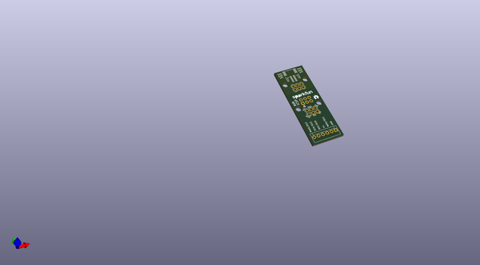
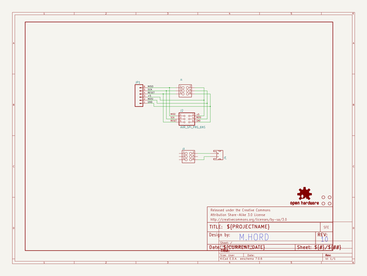
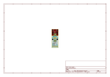
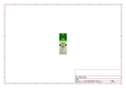
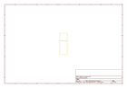
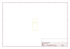
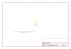

# OOMP Project  
## ISP_Pogo_Board  by sparkfun  
  
oomp key: oomp_projects_flat_sparkfun_isp_pogo_board  
(snippet of original readme)  
  
ISP Pogo Adapter  
================  
  
[    
*ISP Pogo Adapter(KIT-11591)*](https://www.sparkfun.com/products/11591)  
  
This is a simple adapter board that allows you to adapt pogo pins to an 6-pin ISP header.   
  
Repository Contents  
-------------------  
* **/Hardware** - All Eagle design files (.brd, .sch)  
  
License Information  
-------------------  
The hardware is released under [Creative Commons Share-alike 3.0](http://creativecommons.org/licenses/by-sa/3.0/).   
  full source readme at [readme_src.md](readme_src.md)  
  
source repo at: [https://github.com/sparkfun/ISP_Pogo_Board](https://github.com/sparkfun/ISP_Pogo_Board)  
## Board  
  
  
## Schematic  
  
  
  
[schematic pdf](working_schematic.pdf)  
## Images  
  
  
  
  
  
  
  
  
  
  
  
  
  
  
  
  
