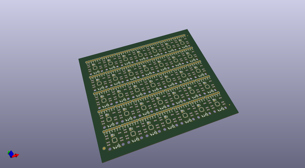
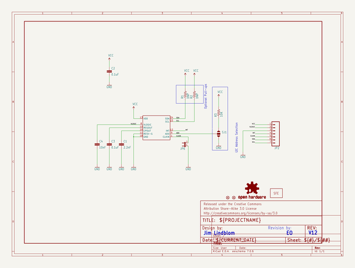
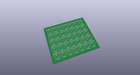
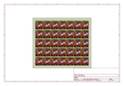
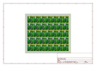
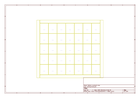
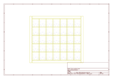
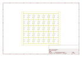

# OOMP Project  
## ITG-3200_Breakout  by sparkfun  
  
(snippet of original readme)  
  
ITG-3200 Breakout Board  
===================================================  
  
[  
*Triple-Axis Digital-Output Gyro ITG-3200 Breakout(SEN-11977)*](https://www.sparkfun.com/products/11977)  
  
This is a breakout board for InvenSense's ITG-3200. This sensor is triple-axis, digital output and a MEMS gyroscope.  
It runs between 2.1 and 3.6V, and communicates over I2C.  
  
Repository Contents  
-------------------  
* **/Firmware** - Any firmware that the part ships with,   
* **/Hardware** - All Eagle design files (.brd, .sch, .STL)  
* **/Production** - Test bed files and production panel files  
  
  
License Information  
-------------------  
The hardware is released under [Creative Commons Share-alike 3.0](http://creativecommons.org/licenses/by-sa/3.0/).    
All other code is open source so please feel free to do anything you want with it; you buy me a beer if you use this and we meet someday ([Beerware license](http://en.wikipedia.org/wiki/Beerware)).  
  
  full source readme at [readme_src.md](readme_src.md)  
  
source repo at: [https://github.com/sparkfun/ITG-3200_Breakout](https://github.com/sparkfun/ITG-3200_Breakout)  
## Board  
  
  
## Schematic  
  
  
  
[schematic pdf](working_schematic.pdf)  
## Images  
  
  
  
  
  
  
  
  
  
  
  
  
  
  
  
  
